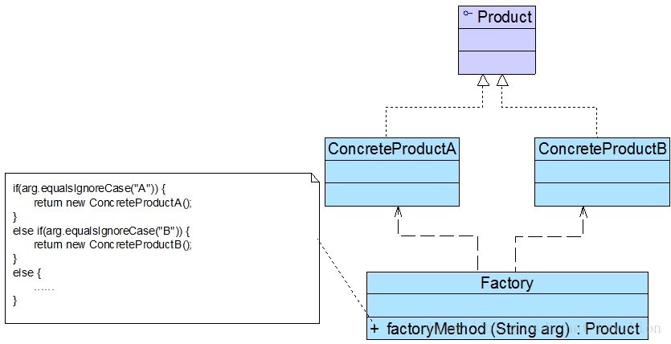
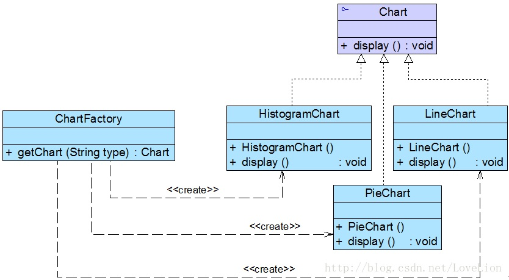
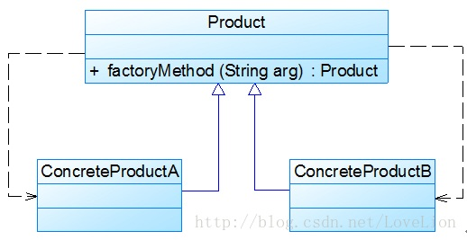

## 创建型模式

创建型模式（Creational Pattern）关注对象的创建过程，是一类常用的设计模式。创建型模式对类的实例化过程进行了抽象，能够将软件模块中对象的创建和对象的使用分离，对用户隐藏了类的实例和创建细节，让用户在使用对象的时候无需关心对象的创建细节，从而降低系统的耦合度，让设计方案更易于修改和扩展。

创建型模式一览表

| 模式名称                                 | 定义                                                         | 学习难度 | 使用频率 |
| ---------------------------------------- | ------------------------------------------------------------ | -------- | -------- |
| 简单工厂模式（Simple Factory Pattern）   | 定义一个工厂类，它可以根据参数的不同返回不同类的实例，被创建的实例通常都具有共同的父类 | ⭐⭐       | ⭐⭐⭐      |
| 工厂方法模式（Factory Method Pattern）   | 定义一个用于创建对象的接口，但是让子类决定将哪一个类实例化。工厂方法模式让一个类的实例化延迟到其子类 | ⭐⭐       | ⭐⭐⭐⭐⭐    |
| 抽象工厂方法（Abstract Factory Pattern） | 提供一个创建一系列相关或相互依赖对象的接口，而无需指定它们具体的类 | ⭐⭐⭐⭐     | ⭐⭐⭐⭐⭐    |
| 建造者模式（Builder Pattern）            | 将一个复杂对象的构建与它的表示分离，使得同样的构建过程可以创建不同的表示 | ⭐⭐⭐⭐     | ⭐⭐       |
| 原型模式（Prototype Pattern）            | 使用原型实例指定待创建对象的类型，并且通过复制这个原型来创建新的对象 | ⭐⭐⭐      | ⭐⭐⭐      |
| 单例模式（Singleton Pattern）            | 确保一个类只有一个实例                                       | ⭐        | ⭐⭐⭐⭐     |

## 简单工厂模式概述

简单工厂模式的设计思想和实现过程都比较简单，其基本实现流程如下：

首先将需要创建的各种不同产品对象的相关代码封装到不同的类中，这些类称为具体产品类，而将它们公共的代码进行抽象和提取后封装在一个抽象产品类中，每一个具体产品类都是抽象产品类的子类；然后提供一个工厂类用于创建各种产品，在工厂类中提供一个创建产品的方法，该方法可以根据所传入的参数不同创建不同的具体产品对象；客户端只需要调用工厂类的工厂方法并传入相应的参数即可得到一个产品对象。

> **简单工厂模式（Simple Factory Pattern）**：定义一个工厂类，它可以根据参数的不同返回不同类的实例，被创建的实例通常都具有共同的父类。

由于在简单工厂模式中用于创建实例的方法通常是静态（static）方法，因此简单工厂模式又被称为静态工厂方法（Static Factory Method）模式。

## 简单工厂模式结构

简单工厂模式包含以下 3 个角色

1. **Factory（工厂角色）**：工厂角色即工厂类，他是简单工厂模式的核心，负责实现创建所有产品实例的内部逻辑；工厂类可以被外界直接调用，创建所需的产品对象；在工厂类中提供了静态的工厂方法 factoryMethod()，它的返回类型为抽象产品类型 Product。
2. **Product（抽象产品角色）**：它是工厂类创建的所有对象的父类，封装了各种产品对象的公有方法，它的引入将提高系统的灵活性，使得在工厂类中只需定义一个通用的工厂方法，因为所有创建的具体产品对象都是其子类对象。
3. **ConcreteProduct（具体产品角色）**：它是简单工厂模式的创建目标，所有被创建的对象都充当这个角色的某个具体类的实例。每一个具体产品角色都继承了抽象产品角色，需要实现在抽象产品中声明的抽象方法。



## 简单工厂模式实现

在简单工厂模式中客户端通过工厂类来创建一个产品类的实例，而无须直接使用 new 关键字来创建对象，它是工厂模式家族中最简单的一员。

在使用简单工厂模式时首先需要对产品类进行重构，不能设计一个包罗万象的产品类，而需要根据实际情况设计一个产品层次结构，将所有产品类公共的代码移至抽象产品类，并在抽象产品类中声明一些抽象方法，一共不同的具体产品来实现。典型的抽象产品类代码的如下：

```java
public abstract class Product {
    // 所有产品类的公共业务方法
    public void methodSame() {
        // 公共方法的实现
    }
    
    // 声明抽象业务方法
    public abstract void methodDiff();
}
```

在具体产品类中实现了抽象产品类中声明的抽象业务方法，不同的具体产品类可以提供不同的实现。典型的具体产品类的代码如下：

```java
public class ConcreteProduct extends Product{
    // 实现业务方法
    public void methodDiff() {
        // 业务方法的实现
    }
}
```

简单工厂模式的核心是工厂类，在没有工厂类之前客户端一般会使用 new 关键字来直接创建产品对象，而在引入工厂类之后客户端可以通过工厂类来创建产品，在简单工厂模式中工厂类提供了一个静态工厂方法供客户端使用，根据所传入的参数不同可以创建不同的产品对象。典型的工厂的代码如下：

```java
public class Factory {
    // 静态工厂方法
    public static Product getProduct(String arg){
        if (arg.equalsIngoreCase("A")){
            product = new ConcreateProductA();
            // 初始化设置 product
        }
        else if (arg.equalsIgnoreCase("B")){
            product = new ConcreateProductB();
            // 初始化设置 product
        }
        return product;
    }
}
```

在客户端代码中，通过调用工厂类的工厂方法即可得到产品对象。其典型代码如下：

```java
public class Client{
    public static void main(String args[]){
        Product product;
        product = Factory.getProduct("A"); // 通过工厂类创建产品对象
        product.methodSame();
        product.methodDiff();
    }
}
```

## 举个例子

### 实例说明：

某软件公司要基于 Java 语言开发一套图表库，该图表库可以为应用系统提供多种不同外观的图表，例如柱状图（HistogramChart）、饼状图（PieChart）、折线图（LineChart)等。该软件公司图表库设计人员希望为应用系统开发人员提供一套灵活易用的图表库，通过设置不同的参数即可得到不同类型的图表，而且可以较为方便地对图表库进行扩展，以便能够在将来增加一些新类型的图表。

现使用简单工厂模式来设计图表库。

### 实例类图



上图中，Chart 接口充当抽象产品类，其子类 HistogramChart、PieChart 和 LineChart 充当具体产品类，ChartFactory 充当工厂类。

### 实例代码

1. Chart：抽象图表接口，充当抽象产品类。

   ```java
   public interface Chart {
       public void display();
   }
   ```

2. HistogramChart：柱状图类，充当具体产品类。

   ```java
   public class HistogramChart implements Chart {
       public HistogramChart() {
           System.out.println("创建柱状图！");
       }
   
       @Override
       public void display() {
           System.out.println("显示柱状图！");
       }
   }
   ```

3. PieChart：饼状图类，充当具体产品类。

   ```java
   public class PieChart implements Chart {
       public PieChart() {
           System.out.println("创建饼状图！");
       }
   
       @Override
       public void display() {
           System.out.println("显示饼状图！");
       }
   }
   ```

4. LineChart：折线图类，充当具体产品类。

   ```java
   public class LineChart implements Chart {
       public LineChart() {
           System.out.println("创建折线图！");
       }
   
       @Override
       public void display() {
           System.out.println("显示折线图！");
       }
   }
   ```

5. ChartFactory：图表工厂类，充当工厂类。

   ```java
   public class ChartFactory {
       // 静态工厂方法
       public static Chart getChart(String type) {
           Chart chart = null;
           if (type.equalsIgnoreCase("histogram")) {
               chart = new HistogramChart();
               System.out.println("初始化设置柱状图！");
           } else if (type.equalsIgnoreCase("pie")) {
               chart = new PieChart();
               System.out.println("初始化设置饼状图！");
           } else if (type.equalsIgnoreCase("line")) {
               chart = new LineChart();
               System.out.println("初始化设置折线图！");
           }
           return chart;
       }
   }
   ```

6. Client：客户端测试类。

   ```java
   public class Client {
       public static void main(String[] args) {
           Chart chart;
           chart = ChartFactory.getChart("histogram"); // 通过静态方法创建产品
           chart.display();
       }
   }
   ```

### 结果及分析

编译并运行程序，输出结果如下：

```tex
创建柱状图！
初始化设置柱状图！
显示柱状图！
```

在客户端测试类中使用工厂类 ChartFactory 的静态工厂方法创建产品对象，如果需要更换产品，只需修改静态工厂方法中的参数即可。

但是创建具体 Chart 对象时必须通过修改客户端代码中静态工厂方法的参数来更换具体产品对象，客户端代码需要重新编译，这对于客户端而言违反了开闭原则。

一种常用的解决方案，可以将静态工厂方法的参数存储在 XML 等配置文件中，通过工具类读取配置文件中的字符串参数，更换图表时只需要改配置文件即可。

## 简单工厂模式的简化

有时候，为了简化简单工厂模式，可以将抽象产品类和工厂类合并，将静态工厂方法移至抽象产品中，如下图所示：



## 简单工厂模式优/缺点与适应环境

### 优点

1. 工厂创建对象，客户端使用对象，实现了对象创建和使用的分离；
2. 客户端无需知道创建的具体产品类的类名，可以在一定程度上减少使用者的记忆量；
3. 通过引入配置文件，可以在不修改客户端代码的情况下更换和增加新的具体类，在一定程度上提高了系统的灵活性。

### 缺点

1. 由于工厂类集中了所有产品的创建逻辑，职责过重，一旦不能正常工作，整个系统都要受到影响；
2. 使用简单工厂模式势必会增加系统中类的个数，增加了系统的复杂度和理解难度；
3. 系统扩展困难，一旦添加新产品就不得不修改工厂逻辑。
4. 由于使用了静态工厂方法，造成工厂角色无法形成基于继承的等级结构。

### 适用环境

1. 工厂类负责创建的对象比较少，不会造成工厂方法中的业务逻辑太过复杂；
2. 客户端只知道传入工厂类的参数，不关心如何创建对象。
