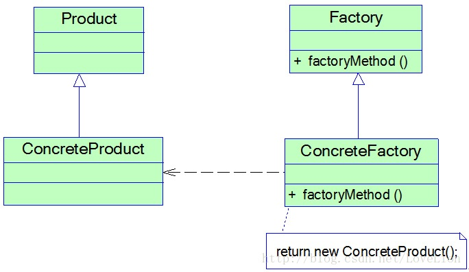
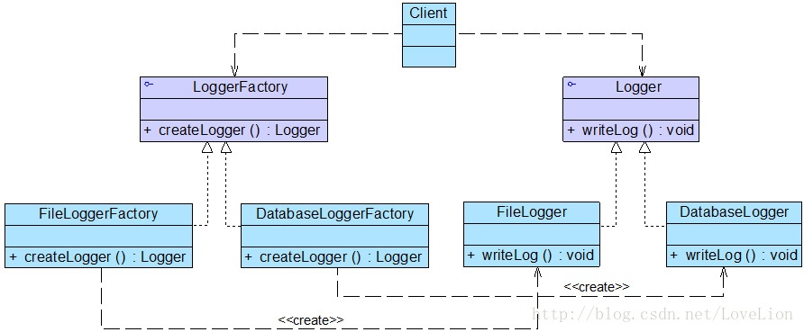
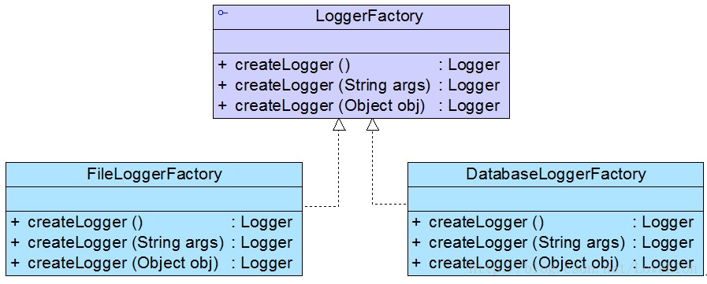
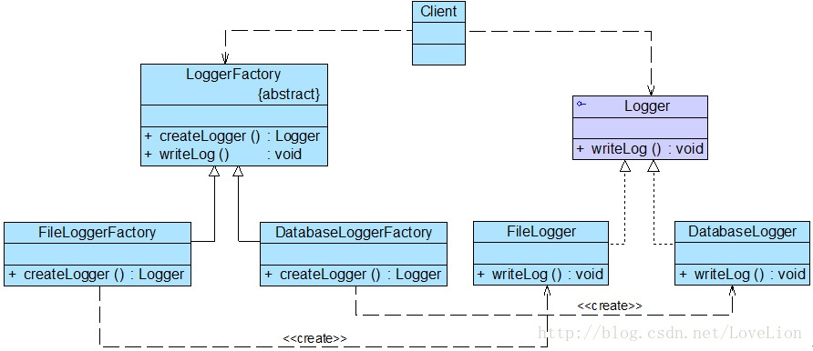

## 工厂方法模式概述

简单工厂模式在新增一个类型时，需要修改工厂类的代码，使得整个设计在一定程度上违反了开闭原则。工厂方法模式通过引入抽象的工厂类，使得它在新增类型时不需要修改具体的工厂类就可以创建，让系统更加符合开闭原则。

在工厂方法模式中不再提供一个同一个的工厂类来创建所有的产品对象，二是针对不同的产品提供不同的工厂，系统提供一个与产品等级接口对应的工厂等级结构。

> **工厂方法模式**：定义一个用于创建实例对象的接口，但是让子类决定将哪一个类实例化。工厂方法模式让一个类的实例化延迟到其子类。
>
> **Factory Method Pattern**: Define an interface for creating an object, but let subclasses decide which class to instantiate. Factory Method lets a class defer instantiation to subclasses.

工厂方法模式简称为工厂模式（Factory Pattern），又可称作虚拟构造器模式（Virtual Constructor Pattern）或多态工厂模式（Polymorphic Factory Pattern）。工厂方法模式时一种类创建型模式。在工厂方法模式中，工厂父类负责定义创建产品对象的公共接口，而工厂子类负责生成具体的产品对象，这样做的目的是将产品类的实例化操作延迟到工厂子类中完成，即通过工厂子类来确定究竟应该实例化哪一个具体产品类。

## 工厂方法模式结构

工厂方法模式提供一个抽象工厂接口来声明抽象工厂方法，而由其子类来具体实现工厂方法，创建具体的产品对象。结构图如下所示：



<center style="font-size:14px;color:#C0C0C0;text-decoration:underline">工厂方法模式结构图</center> 

由上图可知，工厂方法模式包含以下 4 个角色：

1. **Product（抽象产品）**：它时定义产品的接口，是工厂方法模式所创建对象的超类型，也就是产品对象的公共父类。
2. **ConcreteProduct（具体产品）**：它实现了抽象产品接口，某种类型的具体产品由专门的具体工厂创建，具体工厂和具体产品一一对应。
3. **Factory（抽象工厂）**：在抽象工厂类中声明了工厂方法（Factory Method），用于返回一个产品。抽象工厂是工厂方法模式的核心，所有创建对象的工厂类都必须实现该接口。
4. **ConcreteFactory（具体工厂）**：它是抽象工厂类的子类，实现了在抽象工厂中声明的工厂方法，并可由客户端调用，返回一个具体产品类的实例。

## 工厂方法模式实现

与简单工厂模式相比，工厂方法模式最重要的特点是引入了抽象工厂角色，抽象工厂可以是接口，也可以是抽象类或者具体类。其典型代码如下：

```java
public interface Factory {
    public Product factoryMethod();
}
```

在抽象工厂中声明了工厂方法单并未实现工厂方法，具体产品对象的创建由其子类负责，客户端针对抽象工厂编程，可在运行时再指定具体工厂类，具体工厂类实现了工厂方法，不同的具体工厂可以创建不同的具体产品。其典型代码如下：

```java
public class ConcreteFactory implement Factory {
    public Product factoryMethod() {
        return new ConcreteProduct();
    }
}
```

在实际使用时，具体工厂类在实现工厂方法时处理创建具体产品对象之外，还可以负责产品对象的初始化工作以及一些资源和环境配置工作，例如连接数据库、创建文件都能。

在客户端代码中，开发人员只需关心工厂类接口，不同的具体工厂可以创建不同的产品。典型的客户端代码片段如下：

```java
...
Factory factory;
factory = new ConcreteFactory(); // 可通过配置文件与反射机制实现
Product product;
product = factory.factoryMethod();
...
```

可以通过配置文件来存储具体工厂类 ConcreteFactory 的类名，再通过反射机制创建具体工厂对象，在更换新的具体工厂时无需修改源代码，系统扩展更方便。

## 举个例子

### 实例说明

某系统运行日志记录器（Logger）可以通过多种途径保存系统的运行日志，例如通过文件记录或数据库记录，用户可以通过修改配置文件灵活地更换日志记录方式。在设计各类日志记录器时，开发人员需要对日志记录器进行一些初始化工作，初始化参数的设置过程较为复杂，而且某些参数的设置由严格的先后顺序，否则可能会发生记录失败。

为了更好地封装记录器的初始化过程并保证多种记录器切换的灵活性，现使用工厂方法模式设计该系统（注：在 Java 中常用的日志记录工具有 SLF4J、Log4j、GCLogViewer、Logstash 等）。

### 实例类图

通过分析，本实例结构如下图所示：




<center style="font-size:14px;color:#C0C0C0;text-decoration:underline">日志记录器结构图</center> 

Logger 接口充当抽象产品，其子类 FileLogger 和 DatabaseLogger 充当具体产品，LoggerFactory 接口充当抽象工厂，其子类 FileLoggerFactory 和 DatabaseLoggerFactory 充当具体工厂。

### 实例代码

1. Logger：日志记录器接口，充当抽象产品角色。

   ```java
   public interface Logger {
       public void writeLog();
   }
   ```

2. DatabaseLogger：数据库日志记录器，充当具体产品角色。

   ```java
   public class DatabaseLogger implements Logger {
       @Override
       public void writeLog() {
           System.out.println("数据库日志记录。");
       }
   }
   ```

3. FileLogger：文件日志记录器，充当具体产品角色。

   ```java
   public class FileLogger implements Logger {
       @Override
       public void writeLog() {
           System.out.println("文件日志记录。");
       }
   }
   ```

4. LoggerFactory：日志记录工厂接口，充当抽象工厂角色

   ```java
   public interface LoggerFactory {
       public Logger createLogger(); // 抽象工厂方法
   }
   ```

5. DatabaseLoggerFactory：数据库日志记录器工厂类，充当具体工厂角色。

   ```java
   public class DatabaseLoggerFactory implements LoggerFactory {
       @Override
       public Logger createLogger() {
           // 连接数据库，代码省略
           // 创建数据库日志记录器对象
           Logger logger = new DatabaseLogger();
           // 初始化数据库日志记录器，代码省略
           return logger;
       }
   }
   ```

6. FileLoggerFactory：文件日志记录器工厂类，充当具体工厂角色。

   ```java
   public class FileLoggerFactory implements LoggerFactory {
       @Override
       public Logger createLogger() {
           // 创建文件日志记录器对象
           Logger logger = new FileLogger();
           // 创建文件，代码省略
           return logger;
       }
   }
   ```

7. Cilent：客户端测试类。

   ```java
   public class Client {
       public static void main(String[] args) {
           LoggerFactory factory;
           Logger logger;
           factory = new FileLoggerFactory(); // 可引入配置文件和反射机制实现
           logger = factory.createLogger();
           logger.writeLog();
       }
   }
   ```

### 结果及分析

编译并运行程序，输出结果如下：

```tex
文件日志记录。
```

如果需要增加并使用新的日志记录器，只需要对应增加一个新的具体工厂类，然后在客户端代码中修改具体工厂类的类名，原有类库的源代码无需做任何修改。

通过引入配置文件并使用反射机制可以实现在不修改客户端代码的基础上更换具体工厂类，让系统用更加符合开闭原则，具备更好的灵活性和可扩展性。

## 反射机制与配置文件

上面的实例中，在更换日志记录器时需要修改客户端代码，对于客户端而言并不符合开闭原则，本节将介绍如何在不修改客户端代码的基础上更换或增加新的日志记录方式。

在实际应用开发中，可以对具体工厂类的实例化过程进行修改，在客户端代码中不直接使用 new 关键字来创建工厂对象，而是通过 Java 反射机制结合配置文件（例如 XML 文件）来生成具体工厂对象。

1. Java 反射机制

   Java 反射（Java Reflection）是指在程序运行时获取已知名称的类或已有对象的相关信息的一种机制，包括类的方法、属性、父类等信息，还包括实例的创建和实例类型的判断等。

   ```java
   // 通过类名生成实例对象并将其返回
   Class c = Class.forName("java.lang.String");
   Object obj = c.newInstence();
   return obj;
   ```

2. 配置文件

   软件系统的配置文件通常为 XML 文件，可以使用 DOM（Document Object Model）、SAX（Simple API for XML）、StAX（Streaming API for XML）等技术来处理 XML 文件。

   在软件开发中可以把类名存储到 XML 配置文件中，再读取配置文件获取类名字符串，然后通过 Java 反射机制来创建对象。

   ```xml
   <!-- config.xml -->
   <?xml version="1.0"?>
   <config>
       <className>designpatterns.factorymethod.FileLoggerFactory</className>
   </config>
   ```

   为了读取该配置文件，并通过存储再其中的类名字符串反射生成对象，可以创建一个工具类 XMLUtil，其详细代码如下：

   ```java
   import org.w3c.dom.*;
   import javax.xml.parsers.*;
   import java.io.File;
   
   public class XMLUtil {
       // 该方法用于从 XML 配置文件中提取具体类的类名，并返回一个实例对象
       public static Object getBean() {
           try {
               // 创建 DOM 文档对象
               DocumentBuilderFactory dFactory = DocumentBuilderFactory.newInstance();
               DocumentBuilder builder = dFactory.newDocumentBuilder();
               Document doc;
               doc = builder.parse(new File("design-pattern/src/main/java/com/wangyq/factorymethod/config.xml"));
   
               // 获取包含类名的文本结点
               NodeList nl = doc.getElementsByTagName("className");
               Node classNode = nl.item(0).getFirstChild();
               String cName = classNode.getNodeValue();
   
               // 通过类名生成实例对象并将其返回
               Class c = Class.forName(cName);
               Object obj = c.newInstance();
               return obj;
           } catch (Exception e) {
               e.printStackTrace();
               return null;
           }
       }
   
       public static void main(String[] args) {
           Object bean = getBean();
           String simpleName = bean.getClass().getSimpleName();
           System.out.println(simpleName);
       }
   }
   ```

   有了 XMLUtil 类之后，可以对日志记录器的客户端代码进行修改，不再直接使用 new 关键字来创建具体的工厂类，而是将 具体 工厂列的类名存储在 XML 文件中，再通过 XMLUtil 类的静态工厂方法 getBean() 进行对象的实例化，将代码修改如下：

   ```java
   public class Client {
       public static void main(String[] args) {
           LoggerFactory factory;
           Logger logger;
           factory = (LoggerFactory) XMLUtil.getBean(); // getBean() 的返回类型为 Object，需要进行强制类型转换
           logger = factory.createLogger();
           logger.writeLog();
       }
   }
   ```

在引入 XMLUtil 类和 XML 配置文件之后，如果需要增加一种新类型的日志记录方式，只需要执行以下 4 个步骤：

1. 新的日志记录器需要继承抽象日志记录器 Logger；
2. 对应增加一个新的具体日志记录器工厂，继承抽象日志记录器工厂 LoggerFactory，并实现其中的工厂方法 createLogger()，设置好初始化参数和环境变量，返回具体日志记录器对象。
3. 修改配置文件 config.xml，用新增的具体日志记录器工厂类的类名字符串替换原有工厂类的类名字符串。
4. 编译新增的具体日志记录器类和具体日志记录器工厂类，运行客户端测试类即可使用新的日志记录方式，而原有类库代码无须做任何修改，完全符合开闭原则。

## 工厂方法的重载

在某些情况下，可以通过多种方式来初始化同一个产品类。此时可以提供一个重载的工厂方法，以不同的方式对产品对象进行创建。对于同一个具体工厂而言，无论使用哪个工厂方法，所创建的产品类型均要相同。重载的工厂方法结构图如下图所示：


重载的工厂方法结构图

<center style="font-size:14px;color:#C0C0C0;text-decoration:underline">重载的工厂方法结构图</center> 

引入重载方法后，抽象工厂类 LoggerFactory 的代码修改如下：

```java
public interface LoggerFactory {
    public Logger createLogger(); // 抽象工厂方法
    public Logger createLogger(String args);
    public Logger createLogger(Object obj);
}
```

具体工厂类 DatabaseLoggerFactory 的代码修改如下：

```java
public class DatabaseLoggerFactory implements LoggerFactory {
    @Override
    public Logger createLogger() {
        // 使用默认方式连接数据库，代码省略
        Logger logger = new DatabaseLogger();
        // 初始化数据库日志记录器，代码省略
        return logger;
    }

    @Override
    public Logger createLogger(String args) {
        // 使用参数 args 作为连接字符串来连接数据库，代码省略
        Logger logger = new DatabaseLogger();
        // 初始化数据库日志记录器，代码省略
        return logger;
    }

    @Override
    public Logger createLogger(Object obj) {
        // 使用封装在参数 obj 中的连接字符串来连接数据库，代码省略
        Logger logger = new DatabaseLogger();
        // 使用封装在参数 obj 中的数据来初始化数据库日志记录器，代码省略
        return logger;
    }
}
// 其他具体工厂类代码省略
```

## 工厂方法的隐藏

有时候，为了进一步简化客户端的使用，还可以对客户端隐藏工厂方法，此时在工厂类中直接调用产品类的业务方法，客户端无需调用工厂方法创建产品对象，直接使用工厂对象即可调用所创建的产品对象中的业务方法。

如果对客户端隐藏工厂方法，那么日志记录器结构图可修改为如下图所示


隐藏工厂方法后的日志记录器结构图


抽象工厂类的代码修改如下：

```java
// 将接口改为抽象类
public abstract class LoggerFactory {
    // 在工厂类中直接调用日志记录器的业务方法 writeLog()
    public void writeLog() {
        Logger logger = this.createLogger();
        logger.writeLog();
    }
    
    public abstract Logger createLogger();
}
```

客户端代码修改如下：

```java
public class Client {
    public static void main(String[] args) {
        LoggerFactory factory;
        factory = (LoggerFactory) XMLUtil.getBean();
        factory.writeLog(); // 直接使用工厂对象来调用产品对象的业务方法
    }
}
```

## 工厂方面模式优/缺点与适应环境

### 工厂方法模式优点

1. 在工厂方法模式中，工厂方法用来创建客户所需要的产品，同时还向客户隐藏了哪种具体产品类将被实例化这一细节，用户只需要关心产品对应的工厂，无需关心创建细节，甚至无需知道具体产品类的类名。
2. 基于工厂角色和产品角色的多态性设计是工厂方法模式的关键。它能够让工厂自主确定创建何种产品对象，而如何创建这个对象的细节完全封装在具体工厂内部。
3. 使用工厂方法模式的另一个优点是在系统中加入新产品时无需修改抽象工厂和抽象产品提供的接口，无需修改客户端，也无需修改其他大的具体工厂和具体产品，而只要添加一个具体工厂和具体产品即可，这样系统的可扩展性也就变的非常好，完全符合开闭原则。

### 工厂方法模式的缺点

1. 在添加新产品时需要编写新的具体产品类，而且还要提供与之对应的具体工厂类，系统中类的个数将成增加，在一定程度上增加了系统的复杂性，有更多的类需要编译和运行，会给系统带来一些额外的开销。
2. 由于考虑到系统的可扩展性，需要引入抽象层，在客户端代码中均使用抽象层进行定义，增加了系统的抽象性和理解难度。

### 工厂方法模式适用环境

1. 客户端不知道它所需要的对象的类。
2. 抽象工厂类通过其子类来指定创建哪个对象。
