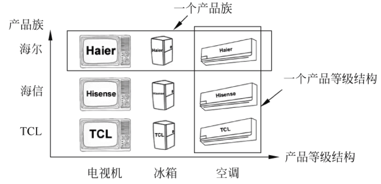
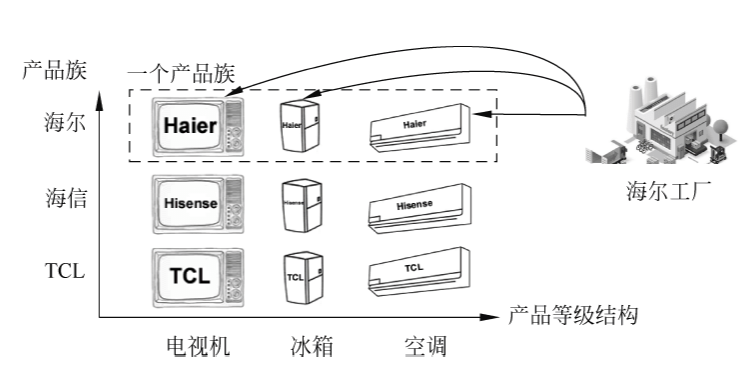
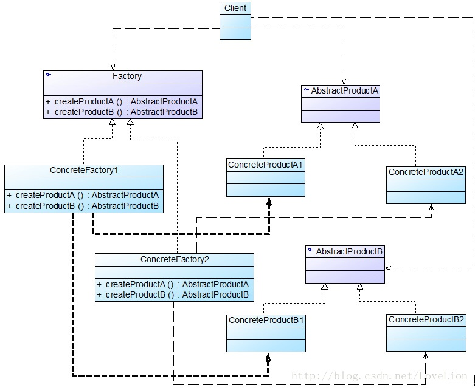
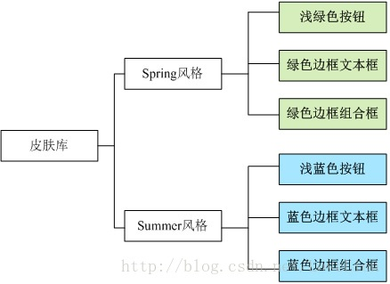
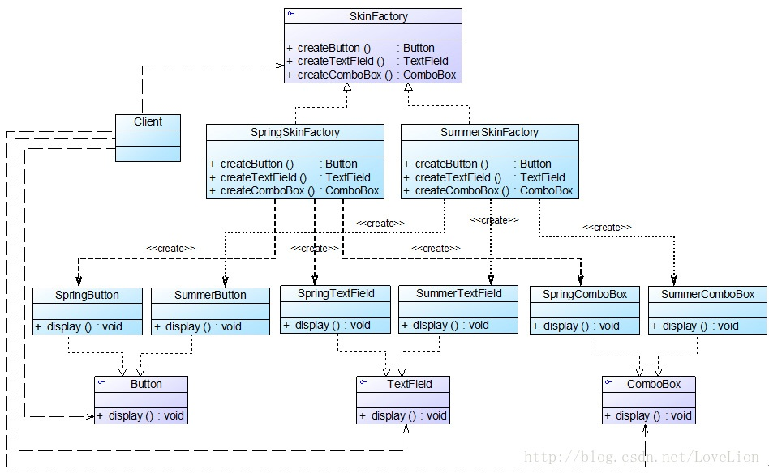

## 产品等级结构和产品族

工厂方法模式通过引入工厂等级结构解决了简单工厂模式中工厂类职责太重的问题，但由于工厂方法模式中的每个具体工厂只有一个或者一组重载的工厂方法，只能生产一种产品，可能会导致系统中存在大量的工厂类，势必会增加系统的开销。有时候可能需要一个工厂可以提供多种产品对象，而不是单一的产品对象，此时可以考虑将一些相关的产品组成一个“产品族”，由一个工厂来统一生产。

为了更好地理解抽象工厂模式，先引入两个概念：

1. 产品等级结构：产品等级结构即产品的继承结构。
2. 产品族：在抽象工厂模式中，产品族是指由同一工厂生产的位于不同产品等级结构中的一组产品。

产品等级结构和产品族示意图如下图所示：



<center style="font-size:14px;color:#C0C0C0;text-decoration:underline">产品族与产品等级结构示意图</center> 

在上图中一共包含了 3 个产品族，分属于 3 个不同的产品等级结构，只要指明一个产品所处的产品族以及它所属的等级结构就可以唯一确定这个产品。

## 抽象工厂模式概述

当系统所提供的工厂生产的具体产品不是一个见到那的对象，而是多个不同产品等级结构、属于不同类型的具体产品时就可以使用抽象工厂模式。

抽象工厂模式是所有形式的工厂模式中最为抽象和最具一般性的一种形式。抽象工厂模式与工厂方法模式最大的区别在于，工厂方法模式针对的是一个产品等级结构，而抽象工厂模式需要面对多个产品等级结构，一个工厂等级结构可以负责多个不同产品等级结构的一个产品族中的产品对象的创建。当一个工厂等级结构可以创建出分属于不同产品等级结构的一个产品族中的所有对象时，抽象工厂模式比工厂方法模式更为简单、更有效率。抽象工厂模式示意图如下图所示：



<center style="font-size:14px;color:#C0C0C0;text-decoration:underline">抽象工厂模式示意图</center> 

抽象工厂模式为创建一组对象提供了一种解决方案。与工厂方法模式相比，抽象工厂模式中的具体工厂不只是创建一种产品，它负责创建一族产品。

> **抽象工厂模式**：提供一个创建一系列相关或相互依赖对象的接口，而无需指定它们具体的类。
>
> **Abstract Factory Pattern**: Provide an interface for creating familes of related or dependent objects without specifying their concrete classes.

抽象工厂模式又称为工具（Kit）模式，它是一种对象创建型模式。

## 抽象工厂模式结构

在抽象工厂模式中，每一个具体工厂都提供了多个工厂方法用于产生多种不同类型的产品，这些产品构成了一个产品族，抽象工厂模式结构如图所示：



<center style="font-size:14px;color:#C0C0C0;text-decoration:underline">抽象工厂模式结构图</center> 

由上图可知，抽象工厂模式包含以下 4 个角色：

1. **AbstractFactory（抽象工厂）**：它声明了一组用于创建一族产品的方法，每一个方法对应一种产品。
2. **ConcreteFactory（具体工厂）**：它实现了在抽象工厂中声明的创建产品的方法，生产一组具体产品，这些产品构成了一个产品族，每一个产品都位于某个产品等级结构中。
3. **AbstractProduct（抽象产品）**：它为每种产品声明接口，在抽象产品中声明了产品所具有的业务方法。
4. **ConcreteProduct（具体产品）**：它定义具体工厂生产的具体产品对象，实现抽象产品接口中声明的业务方法。

## 抽象工厂模式实现

在抽象工厂中声明多个工厂方法，用于创建不同类型的产品，抽象工厂可以时接口，也可以是抽象类或者具体类。其典型代码如下：

```java
public interface AbstractFactory {
    public AbstractProductA createProductA(); // 工厂方法一
    public AbstractProductB createProductB(); // 工厂方法二
}
```

具体工厂实现了抽象工厂，每一个具体的工厂方法可以返回一个特定的产品对象，而同一个具体工厂所创建的产品对象构成了一个产品族。对于每一个具体工厂类，其典型代码如下：

```java
public class ConcreteFactory1 extends AbstractFactory {
    // 工厂方法一
    public AbstractProductA createProductA() {
        return new ConcreteProductA1();
    }
    // 工厂方法二
    public AbstractProductB createProductB() {
        return new ConcreteProductB1();
    }
}
```

与工厂方法模式一样，抽象工厂模式也可以为每一种产品提供一组重载的工厂方法，以不同的方式来创建产品对象。

## 抽象工厂模式应用实例

### 实例说明

某软件公司要开发一套界面皮肤库，可以对基于 Java 的桌面软件进行界面美化。用户在使用时可以通过菜单来选择皮肤，不同的皮肤将提供视觉效果不同的按钮、文本框、组合框等界面元素，例如春天（Spring）风格的皮肤将提供浅绿色的按钮、绿色边框的文本框和绿色边框的组合框，而夏天（Summer）风格的皮肤则提供浅蓝色的按钮、蓝色边框的文本框和蓝色边框的组合框，其结构示意图如下图所示：




<center style="font-size:14px;color:#C0C0C0;text-decoration:underline">界面皮肤库结构示意图</center>

该皮肤库需要具备良好的灵活性和可扩展性，用户可以自由选择不同的皮肤，开发人员可以在不修改既有代码的基础上增加新的皮肤。

### 实力类图

通过分析，本实例的结构图如下图所示：



### 实例代码

1. Button：按钮接口，充当抽象产品。

   ```java
   public interface Button {
       public void display();
   }
   ```

2. SpringButton：Spring 按钮类，充当具体产品。

   ```java
   public class SpringButton implements Button{
       @Override
       public void display() {
           System.out.println("显示浅绿色按钮。");
       }
   }
   ```

3. SummerButton：Summer 按钮类，充当具体产品。

   ```java
   public class SummerButton implements Button {
       @Override
       public void display() {
           System.out.println("显示浅蓝色按钮。");
       }
   }
   ```

4. TextField：文本框接口，充当抽象产品。

   ```java
   public interface TextField {
       public void display();
   }
   ```

5. SpringTextField：Spring 文本框类，充当具体产品。

   ```java
   public class SpringTextField implements TextField{
       @Override
       public void display() {
           System.out.println("显示绿色边框文本框。");
       }
   }
   ```

6. SummerTextField：Summer 文本框类，充当具体产品。

   ```java
   public class SummerTextField implements TextField{
       @Override
       public void display() {
           System.out.println("显示蓝色边框文本。");
       }
   }
   ```

7. ComboBox：组合框接口，充当抽象产品。

   ```java
   public interface ComboBox {
       public void display();
   }
   ```

8. SpringComboBox：Spring 组合框类，充当具体产品。

   ```java
   public class SpringComboBox implements ComboBox{
       @Override
       public void display() {
           System.out.println("显示绿色边框组合框。");
       }
   }
   ```

9. SummerComboBox：Summer 组合框类，充当具体产品。

   ```java
   public class SummerComboBox implements ComboBox{
       @Override
       public void display() {
           System.out.println("显示蓝色边框组合框。");
       }
   }
   ```

10. SkinFactory：界面皮肤工厂接口，充当抽象工厂。

    ```java
    public interface SkinFactory {
        public Button createButton();
        public TextField createTextField();
        public ComboBox createComboBox();
    }
    ```

11. SpringSkinFactory：Spring 皮肤工厂，充当具体工厂。

    ```java
    public class SpringSkinFactory implements SkinFactory{
        @Override
        public Button createButton() {
            return new SpringButton();
        }
    
        @Override
        public TextField createTextField() {
            return new SpringTextField();
        }
    
        @Override
        public ComboBox createComboBox() {
            return new SpringComboBox();
        }
    }
    ```

12. SummerSkinFactory：Summer 皮肤工厂，充当具体工厂。

    ```java
    public class SummerSkinFactory implements SkinFactory {
    
        @Override
        public Button createButton() {
            return new SummerButton();
        }
    
        @Override
        public TextField createTextField() {
            return new SummerTextField();
        }
    
        @Override
        public ComboBox createComboBox() {
            return new SummerComboBox();
        }
    }
    ```

13. 配置文件 config.xml，在配置文件中存储了具体工厂类的类名。

    ```xml
    <?xml version="1.0"?>
    <config>
        <className>com.wangyq.abstractfactory.SpringSkinFactory</className>
    </config>
    ```

14. XMLUtil：工具类

    ```java
    public class XMLUtil {
        //该方法用于从XML配置文件中提取具体类类名， 并返回一个实例对象
        public static Object getBean() {
            try {
                //创建文档对象
                DocumentBuilderFactory dFactory = DocumentBuilderFactory.newInstance();
                DocumentBuilder builder = dFactory.newDocumentBuilder();
                Document doc;
                doc = builder.parse(new File("design-pattern/src/main/java/com/wangyq/abstractfactory/config.xml"));
                //获取包含类名的文本节点
                NodeList nl = doc.getElementsByTagName("className");
                Node classNode = nl.item(0).getFirstChild();
                String cName = classNode.getNodeValue();
                //通过类名生成实例对象并将其返回
                Class c = Class.forName(cName);
                Object obj = c.newInstance();
                return obj;
            } catch (Exception e) {
                e.printStackTrace();
                return null;
            }
        }
    }
    ```

15. Client：客户端测试类

    ```java
    public class Client {
        public static void main(String[] args) {
            // 使用抽象层定义
            SkinFactory factory;
            Button bt;
            TextField tf;
            ComboBox cb;
            factory = (SkinFactory) XMLUtil.getBean();
            bt = factory.createButton();
            tf = factory.createTextField();
            cb = factory.createComboBox();
            bt.display();
            tf.display();
            cb.display();
        }
    }
    ```

### 结果及分析

编译并运行程序，输出结果如下：

```tex
显示浅绿色按钮。
显示绿色边框文本框。
显示绿色边框组合框。
```

如果需要更换皮肤，只需要修改配置文件即可。

如果需要增加新的皮肤，只需增加一族新的具体组件并对应提供一个新的具体工厂，修改配置文件中的具体工厂类名即可使用新的皮肤，原有代码无需修改，符合开闭原则。

## 开闭原则的倾斜性

在抽象工厂模式中增加新的产品等级结构很麻烦，抽象工厂模式的这种性质称为开闭原则的倾斜性。开闭原则要求对扩展开放，对修改关闭，通过扩展达到增强其功能的目的，对于涉及多个产品族与多个产品等级结构的系统，其功能增强包括两个方面。

1. 增加产品族：对于增加新的产品族，抽象工厂模式很好地支持了开闭原则，只需要增加具体产品并对应增加一个新的具体工厂，对已有代码无需做任何修改。
2. 增加新的产品等级结构：对于增加新的产品等级结构，需要修改所有工厂角色，包括抽象工厂类，在所有的工厂类中都需要增加生产新产品的方法，违背开闭原则。

正因为抽象工厂模式存在开闭原则的倾斜性，它以一种倾斜的方式来满足开闭原则，为增加新产品族提供方便，但不能为增加新产品结构提供这样的方便，因此要求设计人员在设计之初就能够考虑全面，不会在设计完成之后再向系统中增加新的产品等级结构，也不会删除已有的产品等级结构，否则将会导致系统出现较大的修改，为后续维护工作带来诸多麻烦。

## 抽象工厂模式优/缺点与使用环境

抽象工厂模式是工厂方法模式的进一步眼神，由于它提供了功能更为强大的工厂类并且具备较好的可扩展性，在软件开发中得以广泛应用，尤其是在一些框架和 API 类库的设计中。

### 抽象工厂模式优点

1. 抽象工厂模式隔离了具体类的生产，使得客户端并不需要知道什么被创建。由于这种隔离，更换一个具体工厂就变得相对榕溪，所有的具体工厂都实现了抽象工厂中定义的那些公共接口，因此只需改变具体工厂的实例就可以在某种程度上改变整个软件系统的行为。
2. 当一个产品族中的多个对象被设计成一起工作时，它能够保证客户端始终只使用同一个产品族中的对象。
3. 增加新的产品族很方便，无需修改已有系统，符合开闭原则。

### 抽象工厂模式缺点

增加新的产品等级结构麻烦，需要对原有系统进行较大的修改，甚至需要修改抽象层代码，这显然会带来较大的不变，违背了开闭原则。

### 抽象工厂模式适用环境

1. 一个系统不应当依赖于产品类实例如何被创建、组合和表达的细节，这对于所有类型的工厂模式都是很重要的，用户无需关系对象的创建过程，将对象的创建和使用解耦。
2. 系统中有多于一个的产品族，而每次只是用其中某一产品族。可以通过配置文件等方式来使用户能够动态改变产品族，也可以很方便地增加新的产品族。
3. 属于同一个产品族的产品将在一起使用，这一约束必须在系统的设计中体现出来。
4. 产品等级结构稳定，在设计完成之后不会向系统中增加新的产品等级结构或者删除已有的产品等级结构。
