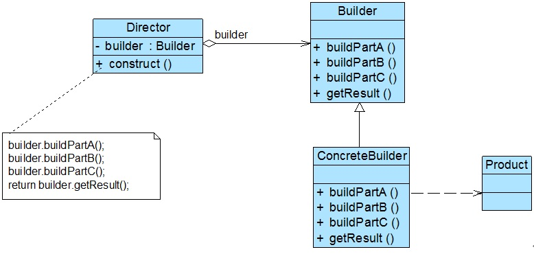
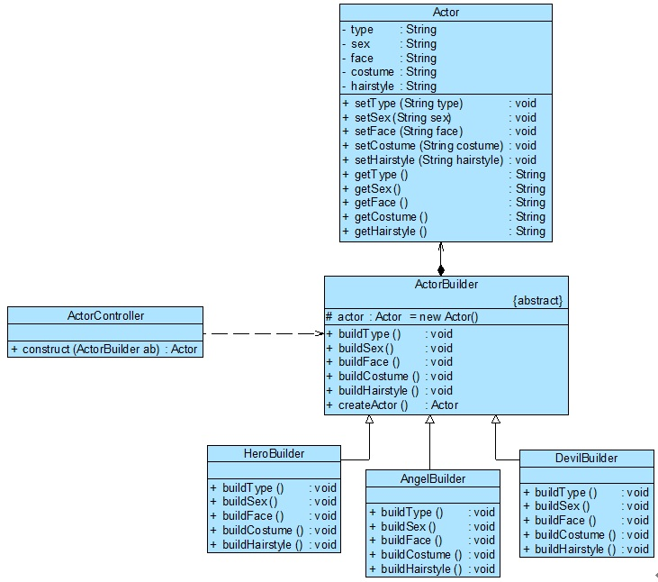

## 创造者模式概述

建造者模式可以将部分本身和它们得组装过程分开，关注如何一步一步地创建一个包含多个组成部分得复杂对象，用户只需要指定复杂对象的类型即可得到该对象，而无需知道其内部的具体构造细节。

> **建造者模式**：将一个复杂对象的构建与它的表示分离，使得同样的构建过程可以创建不同的表示。
>
> **Builder Pattern**: Separate the construction of a complex object from its representation so that the same construction process can create different representations.

## 建造者模式结构

建造者模式的结构如下图所示：



<center style="font-size:14px;color:#C0C0C0;text-decoration:underline">建造者模式结构图</center> 

由上图可知，建造者模式包含以下 4 个角色。

1. **Builder（抽象建造者）**：它为创建一个产品对象的各个部件指定抽象接口，在该接口中一般声明两类方法，一类方法是 buildPartX()，它们用于创建复杂对象的各个部件；另一类方法是 getResult()，它们用于返回复杂对象。Builder 既可以是抽象类，也可以是接口。
2. **ConcreteBuilder（具体建造者）**：它实现了 Builder 接口，实现各个部件的具体构造和装配方法，定义并明确所创建的复杂对象，还可以提供一个方法返回创建好的复杂产品对象（该方法也可以由抽象建造者实现）。
3. **Product（产品）**：它是被构建的复杂对象，包含多个组成部件，具体建造者创建该产品的内部表示并定义它的装备过程。
4. **Director（指挥者）**：指挥者又称为导演类，它负责安排复杂对象的建造次序，指挥者与抽象建造者之间存在关联关系，可以在其 construct() 建造方法中调用建造者对象的部件构造与装配方法，完成复杂对象的建造。客户端一般只需要与指挥者进行交互，在客户端确定具体建造者的类型，并实例化具体建造者对象（也可以通过配置文件和反射机制实现），然后通过指挥者类的构造函数或者 Setter 方法将该对象传入指挥者类中。

## 建造者模式实现

在建造者模式的定义中提到了复杂对象，那什么是复杂对象呢？简单来说，复杂对象是指那些包含多个成员变量的对象，这些成员变量也称为部件或零件。一个典型的复杂对象类的代码示例如下：

```java
public class Product {
    private String partA; // 定义部件，部件可以是任意类型，包括值类型和引用类型
    private String partB;
    private String partC;
    // partA的Getter方法和Setter方法省略
    // partB的Getter方法和Setter方法省略
    // partC的Getter方法和Setter方法省略
}
```

在抽象建造者类中定义了产品的创建方法和返回方法，其典型代码如下：

```java
public abstract class Builder {
    // 创建产品对象
    protected Product product = new Product();
    
    public abstract void buildPartA();
    public abstract void buildPartB();
    public abstract void buildPartC();
    
    // 返回产品对象
    public Product getResult() {
        return product;
    }
}
```

在抽象类 Builder 中声明了一系列抽象的 buildPartX() 方法，用于创建复杂产品的各个部件，具体创造过程在 ConcreteBuilder 中实现，此外还提供了工厂方法 getResult()，用于返回一个已创建好的完整产品对象。

在 ConcreteBuilder 中实现了这些 buildPartX() 方法，通过调用 Product 的 setPartX() 方法可以给产品对象的成员变量设值，不同的具体建造者在实现 buildPartX() 方法时有所区别，例如 setPartX() 方法的参数可能不一样，在有些具体建造者类中某些 setPartX() 方法无需实现（提供一个空实现）。而这些对于客户端来说都无需关心，客户端只需知道具体建造者类型即可。典型的具体建造者类代码如下：

```java
public class ConcreteBuilder1 extends Builder {
    public void buildPartA() {
        product.setPartA("A1");
    }
    
    public void buildPartB() {
        product.setPartB("B1");
    }
    
    public void buildPartC() {
        product.setPartC("C1");
    }
}
```

此外，在建造者模式中还引入了一个指挥者类 Director，该类主要有两个作用：一方面它隔离了客户端与创建过程；另一方面它控制产品对象的创建过程，包括某个 buildPartX() 方法是个被调用以及多个 buildPartX() 方法调用的先后次序等。指挥者针对抽象建造者编程，客户端只需要知道具体建造者的类型便可通过指挥者类调用建造者的相关方法，返回一个完整的产品对象。指挥者的示例代码如下：

```java
public class Director {
    private Builder builder;
    
    public Director(Builder builder) {
        this.builder = builder;
    }
    
    public void setBuilder(Builder builder) {
        this.builder = builder;
    }
    
    // 产品构建和组装方法
    public Product construct() {
        builder.buildPartA();
        builder.buildPartB();
        builder.buildPartC();
        return builder.getResult();
    }
}
```

在指挥者类中可以注入一个抽象建造者类型的对象，它提供了一个建造方法 construct()，在该方法中调用了 builder 对象的构造部件的方法，最后返回一个产品对象。

对于客户端而言，只需要关心具体建造者的类型，无需关心产品对象的具体组装过程。通常，客户类代码片段如下：

```java
...
Builder builder = new ConcreteBuilder1(); // 可通过配置文件实现
Director director = new Director(builder);
Product product = director.construct();
...
```

可以通过配置文件来存储具体建造者类 ConcreteBuilder1 的类名，使得在更换新的建造者时无需修改源代码，系统扩展更方便。

建造者模式与抽象工厂模式都是较为复杂的创建型模式，建造者模式返回一个完整的复杂产品，抽象工厂模式返回一系列相关的产品；在抽象工厂模式中，客户端通过选择具体工厂来生成所需对象，而在建造者模式中，客户端通过指定具体建造者类型来指导 Director 类如何去生成对象，侧重于一步步构造一个复杂对象，然后将结果返回。如果将抽象工厂模式看成一个骑车配件生产厂，生成不同类型的骑车配件，那么建造者模式就是一个骑车组装常，通过对配件进行组装返回一辆完整的汽车。

## 建造者模式应用实例

### 实例说明

某游戏软件公司决定开发一款基于角色扮演的多人在线网络游戏，玩家可以在游戏中扮演虚拟世界中的一个特定角色，角色根据不同的游戏情节和统计数据（例如力量、魔法、技能等）具有不同的能力，角色也会随着不断升级而拥有更加强大的能力。

作为该游戏的一个重要组成部分，需要对游戏角色进行设计，而且随着游戏的升级将不断增加新的角色。通过分析发现，游戏角色是一个复杂对象，它包含性别、脸型等多个组成部分，不同类型的游戏角色，其性别、脸型、服装、发型等外部特征都有所差异，例如“天使”拥有着美丽的面容和披肩的长发，并身穿一袭白裙；而“恶魔”及其丑陋，留着光头并穿着一件刺眼的黑衣。

无论是何种造型的游戏角色，它的创建步骤都大同小异，都需要逐步创建其组成部分，再将各组成部分装配成一个完整的游戏角色。

试使用建造者模式来实现游戏角色的创建。

### 实例类图

通过分析，本实例的结构如图所示：



<center style="font-size:14px;color:#C0C0C0;text-decoration:underline">游戏角色创建结构图</center>

### 实例代码

1. Actor：游戏角色类，充当复杂产品对象。考虑到代码的可读性，在此只列出部分成员变量，且成员变量的类型均为 String，在真实情况下，有些成员变量的类型需要自定义。

   ```java
   public class Actor {
       private String type; // 角色类型
       private String sex; // 性别
       private String face; // 脸型
       private String costume; // 服装
       private String hairstyle; // 发型
   
       public void setType(String type){
           this.type = type;
       }
   
       public void setFace(String face){
           this.face = face;
       }
   
       public void setSex(String sex) {
           this.sex = sex;
       }
   
       public void setCostume(String costume){
           this.costume = costume;
       }
   
       public void setHairstyle(String hairstyle) {
           this.hairstyle = hairstyle;
       }
   
       public String getType() {
           return type;
       }
   
       public String getSex() {
           return sex;
       }
   
       public String getFace() {
           return face;
       }
   
       public String getCostume() {
           return costume;
       }
   
       public String getHairstyle() {
           return hairstyle;
       }
   }
   ```

2. ActorBuilder：游戏角色创建者，充当抽象建造者。

   ```java
   public abstract class ActorBuilder {
       protected Actor actor = new Actor();
   
       public abstract void buildType();
       public abstract void buildSex();
       public abstract void buildFace();
       public abstract void buildCostume();
       public abstract void buildHairstyle();
   
       // 工厂方法，返回一个完整的游戏角色对象
       public Actor createActor() {
           return actor;
       }
   }
   ```

3. HeroBuilder：英雄角色建造者，充当具体建造者。

   ```java
   public class HeroBuilder extends ActorBuilder {
       @Override
       public void buildType() {
           actor.setType("英雄");
       }
   
       @Override
       public void buildSex() {
           actor.setSex("男");
       }
   
       @Override
       public void buildFace() {
           actor.setFace("英俊");
       }
   
       @Override
       public void buildCostume() {
           actor.setCostume("盔甲");
       }
   
       @Override
       public void buildHairstyle() {
           actor.setHairstyle("飘逸");
       }
   }
   ```

4. AngleBuilder：天使角色建造者，充当具体建造者。

   ```java
   public class AngleBuilder extends ActorBuilder {
       @Override
       public void buildType() {
           actor.setType("天使");
       }
   
       @Override
       public void buildSex() {
           actor.setSex("女");
       }
   
       @Override
       public void buildFace() {
           actor.setFace("漂亮");
       }
   
       @Override
       public void buildCostume() {
           actor.setCostume("白裙");
       }
   
       @Override
       public void buildHairstyle() {
           actor.setHairstyle("披肩长发");
       }
   }
   ```

5. DevilBuilder：恶魔角色建造者，充当具体建造者。

   ```java
   public class DevilBuilder extends ActorBuilder {
   
       @Override
       public void buildType() {
           actor.setType("恶魔");
       }
   
       @Override
       public void buildSex() {
           actor.setSex("妖");
       }
   
       @Override
       public void buildFace() {
           actor.setFace("丑陋");
       }
   
       @Override
       public void buildCostume() {
           actor.setCostume("黑衣");
       }
   
       @Override
       public void buildHairstyle() {
           actor.setHairstyle("光头");
       }
   }
   ```

6. ActorController：角色控制器，充当指挥者。

   ```java
   public class ActorController {
       // 逐步构建复杂产品对象
       public Actor construct(ActorBuilder ab) {
           Actor actor;
           ab.buildType();
           ab.buildSex();
           ab.buildFace();
           ab.buildCostume();
           ab.buildHairstyle();
           actor = ab.createActor();
           return actor;
       }
   }
   ```

7. 配置文件 config.xml，在配置文件中存储了具体建造者类的类名。

   ```xml
   <?xml version="1.0"?>
   <config>
       <className>com.wangyq.builder.AngleBuilder</className>
   </config>
   ```

8. XMLUtil：工具类

   ```java
   // 将 XML 工具类提取到 utils 包中，传入config.xml 文件路径，方便使用
   package com.wangyq.utils;
   
   import org.w3c.dom.Document;
   import org.w3c.dom.Node;
   import org.w3c.dom.NodeList;
   
   import javax.xml.parsers.DocumentBuilder;
   import javax.xml.parsers.DocumentBuilderFactory;
   import java.io.File;
   
   public class XMLUtil {
       public static Object getBean(String filePath) {
           try {
               // 创建 DOM 文档对象
               DocumentBuilderFactory dFactory = DocumentBuilderFactory.newInstance();
               DocumentBuilder builder = dFactory.newDocumentBuilder();
               Document doc;
               doc = builder.parse(new File(filePath));
   
               // 获取包含类名的文本结点
               NodeList nl = doc.getElementsByTagName("className");
               Node classNode = nl.item(0).getFirstChild();
               String cName = classNode.getNodeValue();
   
               // 通过类名生成实例对象并将其返回
               Class c = Class.forName(cName);
               Object obj = c.newInstance();
               return obj;
           } catch (Exception e) {
               e.printStackTrace();
               return null;
           }
       }
   }
   ```

9. Client：客户端测试类

   ```java
   public class Client {
       public static void main(String[] args) {
           ActorBuilder ab; // 针对抽象建造者编程
           ab = (ActorBuilder) XMLUtil.getBean("design-pattern/src/main/java/com/wangyq/builder/config.xml"); // 反射生成具体建造者对象
   
           ActorController ac = new ActorController();
           Actor actor;
           actor = ac.construct(ab); // 通过指挥者创建完整的建造者对象
   
           String type = actor.getType();
           System.out.println(type + "的外观：");
           System.out.println("性别：" + actor.getSex());
           System.out.println("面容：" + actor.getFace());
           System.out.println("服装：" + actor.getCostume());
           System.out.println("发型：" + actor.getHairstyle());
       }
   }
   ```

### 结果及分析

编译并运行程序，输出结果如下：

```tex
天使的外观：
性别：女
面容：漂亮
服装：白裙
发型：披肩长发
```

如果需要更换具体角色建造者，只需要修改配置文件即可。

当需要增加新的具体角色建造者时只需要将新增具体角色建造者作为抽象角色建造者的子类，然后修改配置文件，原有代码无需修改，完全符合开闭原则。

## 指挥者类的深入讨论

指挥者类 Director 是建造者模式的重要组成部分，简单的 Director 类用于指导具体建造者如何构建产品，它按一定次序调用 Builder 的 buildPartX() 的方法，控制调用的先后次序，并向客户端返回一个完整的产品对象。下面讨论几种 Director 的变化形式。

### 省略 Director

在有些情况下，为了简化系统结构，可以将 Director 和抽象建造者 Builder 进行合并，在 Builder 中提供逐步构建复杂产品对象的 construct() 方法。由于 Builder 类通常为抽象类，因此可以将 construct() 方法定义为静态（static）方法，以便客户端能够直接调用。如果将游戏角色实例中的指挥者类 ActorController 省略，ActorBuilder 类的代码修改如下：

```java
public abstract class ActorBuilder {
    protected static Actor actor = new Actor();

    public abstract void buildType();
    public abstract void buildSex();
    public abstract void buildFace();
    public abstract void buildCostume();
    public abstract void buildHairstyle();

    public static Actor construct(ActorBuilder ab) {
        ab.buildType();
        ab.buildSex();
        ab.buildFace();
        ab.buildCostume();
        ab.buildHairstyle();
        return actor;
    }
}
```

此时对应的客户端代码也将发生修改，代码片段如下：

```java
...
ActorBuilder ab; 
ab = (ActorBuilder) XMLUtil.getBean();

Actor actor;
actor = ActorBuilder.construct(ab);
...
```

除此之外，还有一种更简单的处理方式，可以将 construct() 方法中的参数去掉，直接在 construct() 方法中调用 buildPartX() 方法，代码如下：

```java
public abstract class ActorBuilder {
    protected Actor actor = new Actor();

    public abstract void buildType();
    public abstract void buildSex();
    public abstract void buildFace();
    public abstract void buildCostume();
    public abstract void buildHairstyle();

    public Actor construct() {
        this.buildType();
        this.buildSex();
        this.buildFace();
        this.buildCostume();
        this.buildHairstyle();
        return actor;
    }
}
```

客户端代码片段如下：

```java
...
ActorBuilder ab; 
ab = (ActorBuilder) XMLUtil.getBean();

Actor actor;
actor = ab.construct();
...
```

此时，construct() 方法定义了 buildPartX() 方法的调用次序，为 buildPartX() 方法的执行提供了一个流程模板，这与在后边要学习的模板方法非常类似。

以上两种对 Director 类的省略方法都不影响系统的灵活性和可扩展性，同时还简化了系统结构，但加重了抽象建造者类的职责。如果 construct() 方法较为复杂，待构建产品的组成部分比较多，建议还是将 construct() 方法单独封装在 Director 中，这样更符合单一职责原则。

### 钩子方法的引入

钩子方法（Hook Method）用来控制是否对某个 buildPartX() 进行调用。

钩子方法的返回类型通常为 boolean 类型，方法名一般为 isXXX()，钩子方法定义在抽象建造者类中。例如可以在游戏角色的抽象建造者类 ActorBuilder 中定义一个方法 isBareheaded()，用于判断某个角色是否为“光头（Bareheaded）”，在 ActorBuilder 为之提供一个默认实现，代码如下：

```java
public abstract class ActorBuilder {
    protected Actor actor = new Actor();

    public abstract void buildType();
    public abstract void buildSex();
    public abstract void buildFace();
    public abstract void buildCostume();
    public abstract void buildHairstyle();

    // 钩子方法
    public boolean isBareheaded() {
        return false;
    }
    
    public Actor createActor() {
        return actor;
    }
}
```

如果某个角色无需构建头发部件，例如“恶魔”，则对应的具体建造器 DevilBuilder 将覆盖 isBareheaded() 方法，并将返回值改为 true，代码如下：

```java
public class DevilBuilder extends ActorBuilder {

    @Override
    public void buildType() {
        actor.setType("恶魔");
    }

    @Override
    public void buildSex() {
        actor.setSex("妖");
    }

    @Override
    public void buildFace() {
        actor.setFace("丑陋");
    }

    @Override
    public void buildCostume() {
        actor.setCostume("黑衣");
    }

    @Override
    public void buildHairstyle() {
        actor.setHairstyle("光头");
    }
    
    // 覆盖钩子方法
    public boolean isBareheaded() {
        return true;
    }
}
```

同时，指挥者类 ActorController 的代码修改如下：

```java
public class ActorController {
    // 逐步构建复杂产品对象
    public Actor construct(ActorBuilder ab) {
        Actor actor;
        ab.buildType();
        ab.buildSex();
        ab.buildFace();
        ab.buildCostume();
        // 通过钩子方法来控制产品的构建
        if(!ab.isBareHeaded()) {
            ab.buildHairstyle();
        }
        actor = ab.createActor();
        return actor;
    }
}
```

当在客户端代码中置顶具体建造者类型并通过指挥者来实现产品的逐步构建时，将调用钩子方法 isBareheaded() 来判断游戏角色是否有头发，如果 isBareheaded() 方法返回 true，即没有头发，将跳过构建发型的方法 buildHairstyle()，否则将执行 buildHairstyle() 方法。

通过引入钩子方法，可以在 Director 中对复杂产品的构建进行精细的控制，不仅指定 buildPartX() 方法的执行顺序，还可以控制是否需要执行某个 buildPartX() 方法。

## 建造者模式优点：

1. 在建造者模式中，客户端不必知道产品内部组成的细节，将产品本身与产品的创建过程解耦，使得相同的创建过程可以创建不同的产品对象。
2. 每一个具体建造者都相对独立，而与其他的具体建造者无关，因为可以很方便地替换具体建造者或增加新的具体建造，用户使用不同的具体建造者即可得到不同的产品对象。
3. 可以更加精细地控制产品的创建过程。

## 建造者模式缺点：

1. 建造者模式所创建的产品一般具有较多的共同点，其组成部分相似，如果产品之间的差异很大，例如很多组成部分都不相同，不适合使用建造者模式，因此其使用范围受到一定的限制。
2. 如果产品的内部变化复杂，可能会导致需要定义很多具体建造者类来实现这种变化，导致系统变得很庞大，增加系统的理解难度和运行成本。

## 建造者模式适用环境

1. 需要生成的产品对象有复杂的内部结构，这些产品对象通常包含多个成员变量。
2. 需要生成的产品对象的属性相互依赖，需要指定其生成顺序。
3. 对象的创建过程独立于创建该对象的类。在建造者模式中通过引入指挥者类将创建过程封装在指挥者类中，而不在建造者和客户类中。
4. 隔离复杂对象的创建和使用，并使得相同的创建过程可以创建不同的产品。
