# Flink简介

## Flink是什么

Apache Flink是一个框架和分布式处理引擎，用于对无界和有界数据流进行状态计算。

## 为什么选择Flink

流数据更真实的反映了我们的生活方式

传统的数据架构是基于有限数据集的

目标：

- 低延迟
- 高吞吐
- 结果的准确性和良好的容错性

## 流数据适用场景

- 电商和市场营销

- 数据报表、广告投放、业务流程需要

- 物联网（IOT）

- 传感器实时数据采集和显示、实时报警、交通运输业

- 电信业

- 基站流量调配

- 银行和金融业

- 实时结算和通知推送，实时检测异常行为

## 传统数据处理架构

- 事务处理

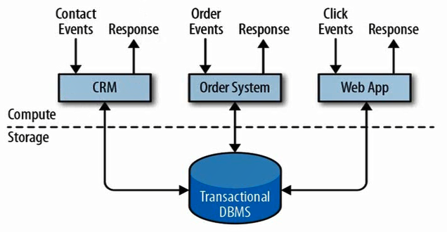

特点：实时性高；并发能力差

- 分析处理

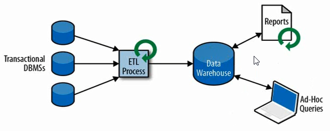

将数据从业务数据库复制到数仓，再进行分析和查询

特点：实时性低，并发能力高

## 有状态的流式处理

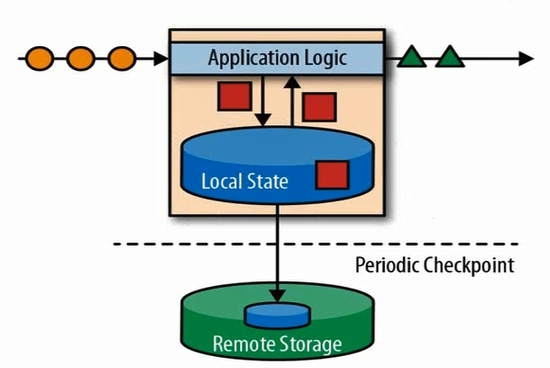

## 流处理的演变

- lambda架构

用两套系统，同时保证低延迟和结果准群

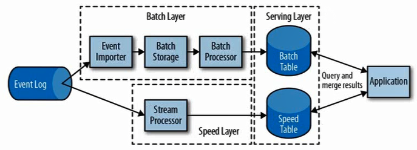

- Flink

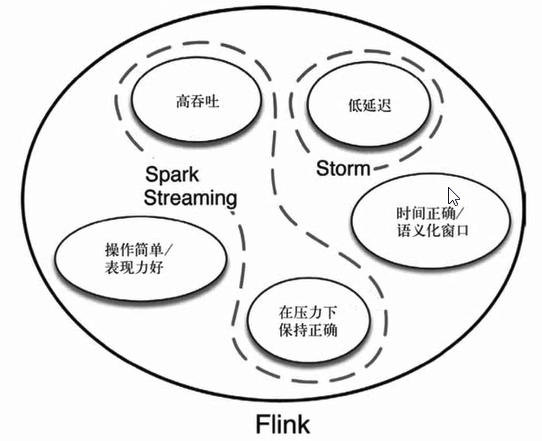

## Flink主要特点

- 事件驱动（Event-driven）
- 基于流的世界观

- 一切都是由流组成的，离线数据是有界的流；实时数据是一个没有界线的流。

- 分层API

- 越顶层越抽象，表达含义越简明，使用越方便
- 越底层越具体，表达能力越丰富，使用越灵活

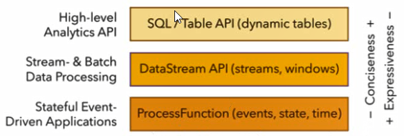

## Flink的其它特点

- 支持事件时间（event-time）和处理事件（processing-time）语义
- 精确一次（exactly-once）的状态一致性保证
- 低延迟，每秒处理数百万个事件，毫秒级延迟
- 与众多常用存储系统的连接
- 高可用，动态扩展，实现7*24小时全天候运行

## Flink VS Spark Streaming

- 流（stream）和微批处理（micro-batching）
- 数据模型

- spark采用RDD模型
- flink具备数据模型是数据流，以及事件序列

- 运行时架构

- spark是批计算，将DAG划分为不同的stage，一个完成后才可以计算下一个
- flink是标准的流执行模式，一个事件在一个节点处理完成后可以直接发往下一个节点进行处理

## Flink部署

### standalone模式

### yarn模式

- Session-Cluster模式

类似与standalone模式，只不过资源由yarn来分配，多个task共用yarn资源

- Pre-Job-Cluster模式

每个任务单独使用一套资源，总资源由yarn来管理

注意：Flink的task和solt的关系，需要占用的solt数=所设置的最大并行度=最大的task数

### Kubernetes部署

略

## 运行时架构

### Flink运行时组件

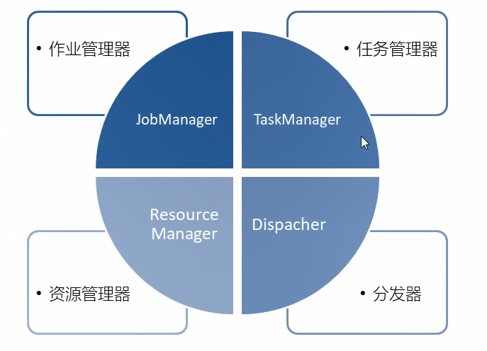

#### JobManager：

- 控制一个应用程序执行的主进程。
- JobManager会先接收到要执行的应用程序，这个应用程序包括：作业图（JobGraph）、逻辑数据流图（logical dataflow graph）和打包了所有的类、库和其他资源的jar包。
- JM会把JobGraph转换成一个物理层面的数据流图，这个图被叫做“执行图”（ExecutionGraph），包含了所有可以并发执行的任务。
- JM会向资源管理器（RM）请求执行任务必要的资源，也就是任务管理器（TM）上的插槽（slot）。一旦它获取到的足够的资源，就会将执行图分发到真正运行他们的TM上。在运行过程中，JM会负责所有需要中央协调的操作，比如checkpoints的协调。

#### TaskManager：

- Flink中的工作进程。 通常在Flink中会有多个TM运行，每一个TM都包含了一定数量的插槽（slot）。插槽的数量限制了TM能够执行的任务数量。
- 启动之后，TM会向RM注册他的插槽；收到RM的指令后，TM就会将一个或者多个插槽提供给JM调用。JM就可以向插槽分配任务来执行了。
- 在执行过程中，一个TM可以跟其他同一应用程序的TM交换数据。

#### ResourceManager：

- 主要负责管理TM的插槽。插槽是Flink中定义的处理资源单元。
- Flink为不同的环境和资源管理工机提供了不同的RM，比如YARN、Mesos、K8s以及standalone部署。
- 当JM申请插槽资源时，RM会将有空闲插槽的TM分配给JM。如果RM没有足够的插槽来满足JM的请求，它还可以向资源提供平台发起绘画，以提供启动TM进程的容器。

#### Dispacher：

- 可以跨作业运行，它为应用提交提供了REST接口。
- 当一个应用被提交执行时，分发器就会启动并将应用移交给一个JM。
- Dispatcher也会启动一个Web UI，用来方便的展示和监控作业执行的信息。
- Dispatcher在架构中可能并不是必须的，这取决于应用提交运行的方式。

#### 任务提交流程

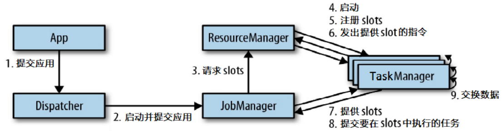

#### 任务提交流程(YARN)

##### 【重点】：单作业（Per-Job）模式

在单作业模式下，Flink集群不会预先启动，而是在提交作业时，才启动新的JobManager。

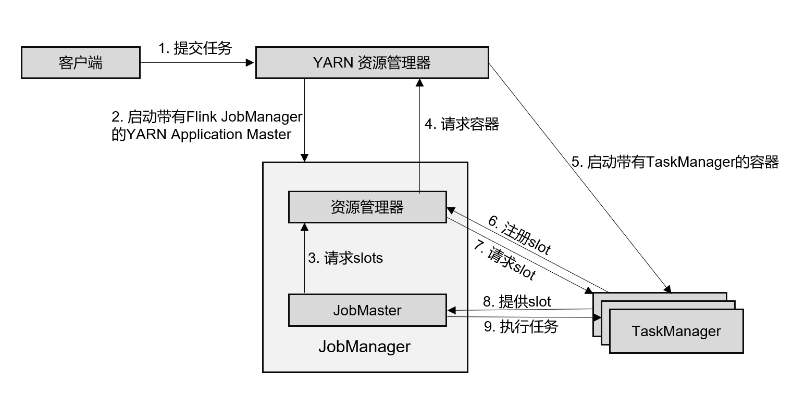

1. 客户端将作业提交给YARN的资源管理器，这一步中会同时将Flink的Jar包和配置上传到HDFS，以便后续启动Flink相关组件的容器。
2. YARN的资源管理器分片Container资源，启动Flink Job Manager，并将作业提交给JobMaster。这里省略了Dispatcher组件。
3. JobMaster向资源管理器请求资源（slots）。
4. 资源管理器向YARN的资源管理器请求container资源。
5. YARN启动新的TaskManager容器。
6. TaskManager启动之后，向Flink的资源管理器注册自己的可用任务槽。
7. 资源管理器通知TaskManager为新的作业提供slots。
8. TaskManager连接到对应的JobManager为新的作业提供slots。
9. JobMaster将需要执行的任务分发给TaskManager，执行任务。

#### 任务调度原理

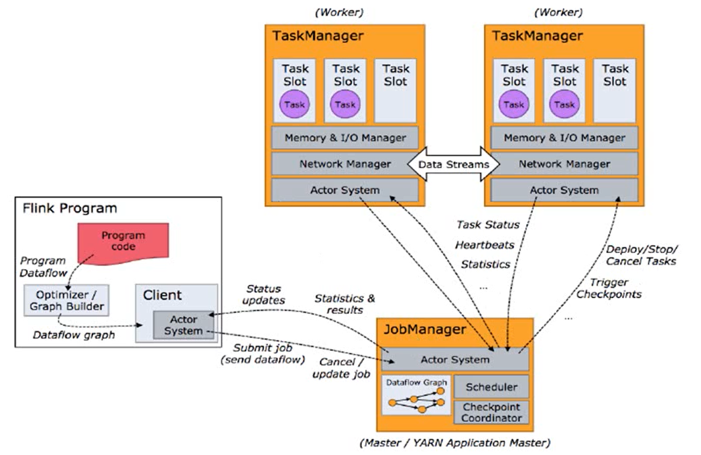

1、基于代码生成数据流图。

2、通过客户端提交到flink集群JobManager，生成可执行的执行流图。

3、tast之间进行数据流交互，执行任务。


- **怎样实现并行计算？**

多线程，通过slot，不同的任务开启不同的线程。

- **并行的任务，需要占用多少slot？**

默认和每个任务的最大并行度有关，取任务最大并行度。

如果设置了slotSharingGroup，按各个slot共享组最大并行度累加。

- **一个流处理程序，到底包含多少个任务？**


##### 并行度（Parallelism）

一个特定算子的子任务（subtask）的个数被称之为并行度。

一个流的并行度和当前任务设置的最大并行度相等。


##### taskManager

每一个taskManager都是一个JVM进程，可能会执行一个或多个子任务。

通过task slot来控制TM能接收多少个task 

##### Slots

不同slot之间内存内存资源隔离，CPU资源不隔离。

推荐按照CPU核数分配Slots个数。

默认情况下，允许子任务共享solt，必须是前后发生的不同任务。一个slot可以保存作业的整个管道。 （提高效率）

Task Slot是静态的概念，是指TaskManager具有的并发执行能力。


#### 程序与数据流（DataFlow）

- 所有的Flink程序都有三步组成：Source、Transformation和Sink。
- dataFlow类似于任意的有向无环图（DAG）

#### 执行流图（ExecutionGraph）

- StreamGraph -> JobGraph -> ExecutionGraph -> 物理执行图

- StreamGraph：根据StreamAPI代码生成的最初的图。用来表示程序的拓扑结构。
- JobGraph：提交给JobManager的数据结构。优化：将多个符合条件的任务chain在一起作为一个结点。
- ExecutionGraph：是JobGraph的并行化版本，是调度层最核心的数据结构。
- 物理执行图：在各个TaskManager上部署task后形成的图，并不是一个具体的数据结构。

#### 数据传输形式

- one-to-one：算子之间不会重分区。例：map、fliter、flatMap等算子。
- redistribution：stream的分区会发生改变。例：keyBy基于hashCode重分区，broadcast和rebalance（轮询方式）会随机重新分区。redistribution过程就类似于spark中的shuffle。

- 算子.shuffle（洗牌）是完全随机重分区。

#### 任务链（Operationn chains）

- 一种优化技术，可以在特点条件下减少本地通信的开销。
- 相同并行度的、同一solt共享组的one-to-one操作，可以连接成同一个任务。

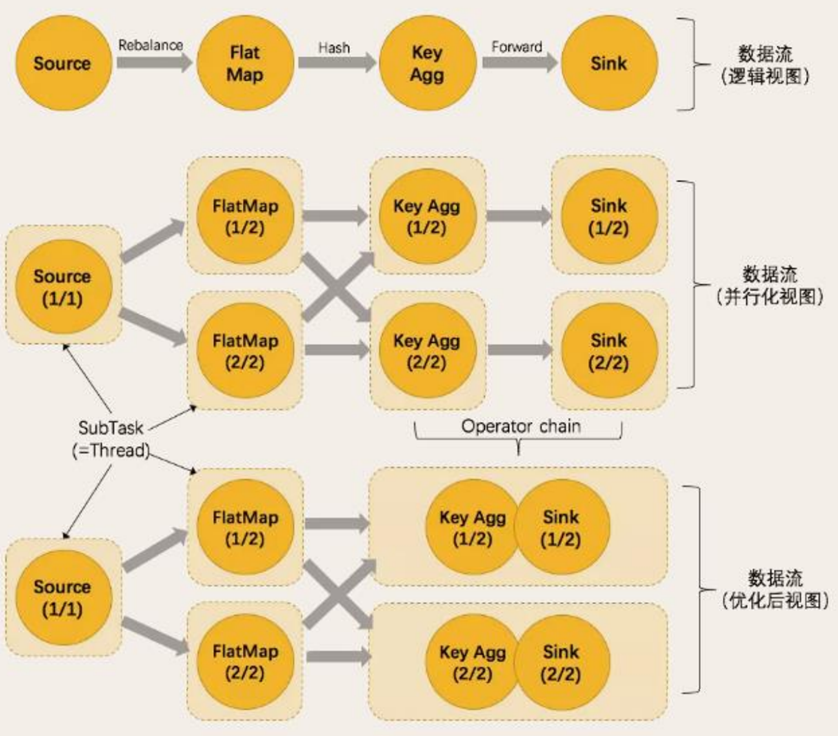

## Flink流处理API

### 1、Environment

1. `getExecutionEnvironment`：自动判断从哪里获取环境
2. `createLocalEnvironment`：从本地获取环境，需要指定
3. `createRemoteEnvironment`：获取远程flink环境

### 2、Source

1. 从集合中读取

`env.fromCollection()`

1. 从文件读取 

`env.readTextFile()`

1. 从 kafka读取

`env.addSource(new FlinkKafkaConsumer011<String>())`

1. 自定义source

`env.addSource(new MySource)`

`MySource`实现`SourceFunction<T>`;

`run()`里边可以写生成数据的代码；`cancel()`里修改控制变量。

### 3、Transform

#### 3.1 map

对数据进行转换

#### 3.2 flatmap

数据打散转换

#### 3.3 filter

对数据进行过滤

#### 3.4 keyBy

DataStream --> KeyedStrea：逻辑的将一个流拆分成不相交的分区，每个分区包含具有相同key的元素，在内部以hash的形式实现分区。

#### 3.5 滚动聚合算子

- sum()
- min()
- max()
- minBy()
- maxBy()

#### 3.6 reduce

keyedStream --> DataStream：一个分组数据流的聚合操作，合并当前元素和上次聚合的结果，产生一个新的值，返回的流中包含每一次聚合的结果，而不是只返回最后一次聚合的最终结果。

#### 3.7 Split和Select

split：DataStrean --> SplitStream：根据某些特征把一个DataStream拆分成两个或者多个DataStream。

select：SplitStream -->  DataStream：从一个SplitStream中获取一个或者多个DataStream。

#### 3.8 Connect和CoMap

Connect：DataStream,DataStream --> ConnectedStreams：连接两个保持他们类型的数据流，两个数据流被Connect之后，**只是被放在了同一个流中**，内部依然保持各自的数据和形式不发生任何变化，两个流相互独立。

CoMap/CoFlatMap：ConnectedStreams --> DataStream :作用于ConnectedStreams上，功能与map和flatMap一样，对ConnectedStreams中的每一个Stream分别进行map和flatMap处理。

#### 3.9 Union

DataStream --> DataStream ：对两个或着两个以上的DataStream进行union操做，产生一个包含所有DataStream元素的新 DataStream。

### 支持的数据类型

Flink使用类型信息的概念来表示数据类型，并为每个数据类型生成特定的序列化器、反序列化器和比较器。

Flink还具有一个类型提取系统，该系统分析函数的输入和返回类型，以自动获取类型信息，从而获得序列化器和反序列化器。

1. 基础数据类型
2. java和scala元组（tuple）
3. scala样例类
4. java简单对象（POJOs）：必须有空参构造，private属性必须有getter和setter
5. Arrays，lists，Maps，Enums......

### 实现UDF函数--更细粒度的控制流

#### 1、函数类（Function Classes）

Flink暴露了所有的udf函数的接口。

#### 2、匿名函数（Lambda Function）

#### 3、富函数（Rich Function）

是DataStream API提供的一个函数类的接口，所有 Flink函数类都有其Rich版本。与常规函数不同，可以获取运行时上下文，并拥有一些生命周期方法，可以实现更复杂的功能。

- RichMapFunction
- RichFlatMapFunction
- RichFilterFunction
- ... ...

生命周期：

- open()方法是richFunction的初始化方法。
- close()是生命周期中最后一个调用的方法，做一些清理工作。
- getRuntimeContext()方法提供了函数RuntimeContext的一些信息，例如函数执行的并行度，任务的名字以及state状态。

### Sink

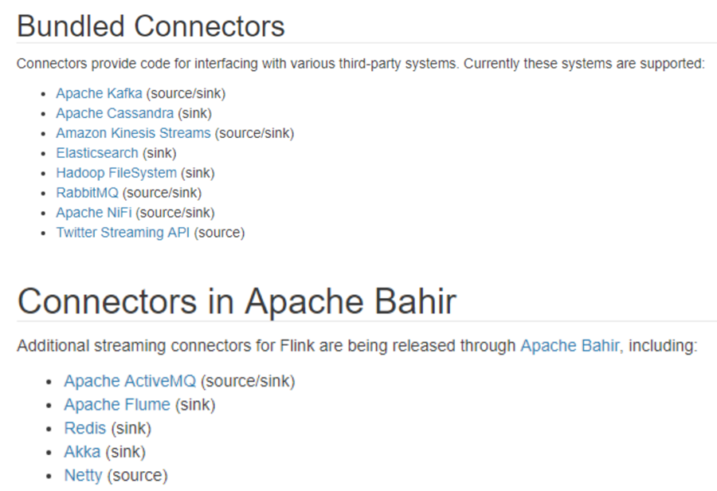

## Flink 中的 Window

### Window 概述

window 是一种**切割无限数据为有限块**进行处理的手段。

### Window 类型

Window 可以分成两类：

- CountWindow： 按照指定的数据条数生成一个 Window，与时间无关。
- TimeWindow： 按照时间生成Window。

1. 滚动窗口（Tumbling Windows）

将数据依据固定的窗口长度对数据进行切片。

特点：时间对齐，窗口长度固定，没有重叠。

1. 滑动窗口（Sliding Windows）

滑动窗口是固定窗口的更广义的一种形式，滑动窗口由固定的窗口长度和滑动 间隔组成。

特 点 ： 时间对齐，窗口长度固定，可以有重叠。

1. 会话窗口（Session Windows）

由一系列事件组合一个指定时间长度的  timeout 间隙组成，类似于  web 应用的 session，也就是一段时间没有接收到新数据就会生成新的窗口。

特点：时间无对齐

###  Window API

TimeWindow（）

CountWindow（）

### window function

- 增量聚合函数（incremental aggregation functions）

每条数据到来就进行计算，保持一个简单的状态。典型的增量聚合函数有 ReduceFunction, AggregateFunction。

- 全窗口函数（full window functions）

先把窗口所有数据收集起来，等到计算的时候会遍历所有数据。 ProcessWindowFunction 就是一个全窗口函数。

- 其它可选  API

.trigger()  ——    触发器

定义window什么时候关闭，触发计算并输出结果

.evitor()  ——    移除器

定义移除某些数据的逻辑

.allowedLateness()  ——    允许处理迟到的数据

.sideOutputLateData()  ——    将迟到的数据放入侧输出流

.getSideOutput()  ——    获取侧输出流

## 时间语义与 Wartermark

### Flink 中的时间语义

Event Time：是事件创建的时间。它通常由事件中的时间戳描述，例如采集的日志数据中，每一条日志都会记录自己的生成时间 ，Flink 通过时间戳分配器访问事 件时间戳。

Ingestion Time：是数据进入 Flink的时间。

Processing Time：是每一个执行基于时间操作的算子的本地系统时间，与机器相关，默认的时间属性就是  Processing Time。

### EventTime 的引入

在Flink的流式处理中，绝大部分的业务都会使用 eventTime，一般只在 eventTime 无法使用时，才会被迫使用  ProcessingTime 或者  IngestionTime。

### Watermark

- 是一种衡量eventTime进展的机制，可以设定延迟触发
- 用于处理乱序事件，通常用watermark机制结合window来实现
- 用来让程序平衡延迟和结果正确性

### WM特点

- WM是一条特殊的数据记录
- WM必须是单调递增的，以确保任务的事件时间时钟在向前推进，而不是在后退
- WM与数据的时间戳有关

### WM的传递

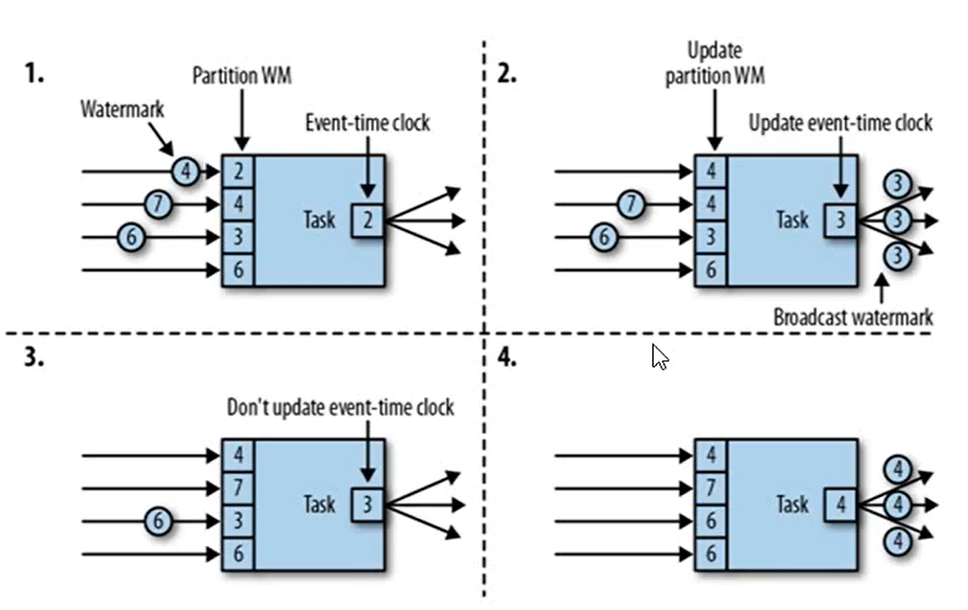

- 上游任务向下游任务广播自己的WM
- 下游任务会收到多个分区的不同WM，然后保存起来，判断哪个WM最小
- 继续向下游广播最小的WM，如果判断后得到的WM值大于当前广播的WM值，就向下游更新广播的WM，否则不做任何操作

### WM的引入

```java
//乱序数据设置时间戳和wartermark

DataStream.assignTimestampsAndWatermarks(new BoundedOutOfOrdernessTimestampExtractor<T>())

//升序数据设置时间戳和wartermark

DataStream.assignTimestampsAndWatermarks(new AscendingTimestampExtractor<T>())
```

可以周期性生成WM或断点式生成WM，自定义生成WM

### WM的设定

- WM的延迟设置太久，收到结果的速度就会很慢，解决办法是在水位线到达之前输出的一个近似结果
- 如果WM到达的太早，则可能收到错误结果，不过Flink处理迟到数据的机制可以解决这个问题

#### 断点式生成：

更新watermark快

数据量大会在同一时间戳会产生大量数据。浪费

数据稀疏推荐使用

#### 周期性生成：

更新不及时

不会产生大量同一时间的WM

稀疏数据也会生成WM，造成浪费

数据稠密推荐使用

#### 窗口起始点

- 获取到数据时间戳之后才分配窗口
- 窗口起始时间为：timestamp - timestamp%windowSize

#### 偏移量 

主要用于处理不同时区的数据，源码有说明

**flink处理迟到数据：**watermark -->  窗口处理迟到的机制  -->  侧输出流批处理合并


## ProcessFunction API（底层 API）

可以访问时间戳、watermark 以及注册定时事件。还可以输出特定的一些事件。

- ProcessFunction
- KeyedProcessFunction
- CoProcessFunction
- ProcessJoinFunction
- BroadcastProcessFunction
- KeyedBroadcastProcessFunction
- ProcessWindowFunction
- ProcessAllWindowFunction

####  KeyedProcessFunction

.processElement()

ctx.timerService()可以在timerService中注册定时事件

.onTime() --> 定时器

使用场景:连续10秒温度上升报警

## Flink状态管理

### 状态

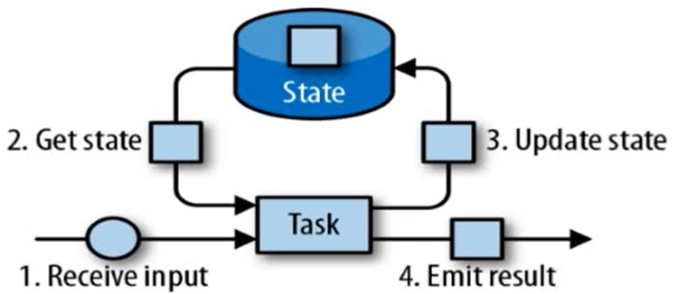

- 由一个任务维护，并且用来计算某个结果的所有数据，都属于这个任务的状态
- 可任务状态就是一个本地变量，可以被任务的业务逻辑访问
- flink会进行状态管理，包括状态一致性，故障处理以及高效存储和访问，以便开发人员可以专注于应用的逻辑
- 状态始终与特定算子相关联，和特定任务绑定
- 算子需要预先注册其状态


两种类型的状态

- 算子状态（Operator State）

- 作用范围限定为算子任务

- 键控状态（Keyed State）

- 根据输入数据流中定义的键来维护和访问

### 算子状态

- 作用范围限定为算子任务，由同一并行任务所处理的所有数据都可以访问到相同的状态
- 对于同一子任务而言是共享的
- 不能由相同或不同算子的另一个子任务访问

**数据结构**

列表状态（list state）

- 将状态表示为一组数据的列表

联合列表状态（union list state ）

- 也将状态表示为数据的列表，与常规列表状态的区别在于，发生故障时，或者从保存点（savepoint）启动应用程序时如何恢复

广播状态（Broadcast state）

- 如果一个算子有多项任务，而他的每项任务状态又都相同，那么这种特殊情况最适合应用广播状态

### 键控状态

- 键控状态根据输入数据流中定义的键来维护和访问
- flink为每个key都维护一个状态实例，并将具有相同键的所有数据，都分区到同一个算子任务中，这个任务会维护和处理这个key对应的状态
- 当任务处理一条数据时，他会自动将状态的访问范围限定为当前数据的key

**数据结**

值状态(value state)

- 将状态表示为单个值

列表状态（list state）

- 将状态表示为一组数据的列表

映射状态（Map state）

- 将状态表示为一组Key-Value对

列表状态（Reducing state & Aggregating state）

- 将状态表示为一个用于聚合操作的列表

**只能在富函数中使用，需要用到runtimeContext**

### 状态后端（state backends）

- 状态的存储、访问以及维护，由一个可插入的组件决定，这个组件就叫做状态后端。
- 主要负责两件事：本地的状态管理，以及将检查点（checkpoints）状态写入远程存储。

#### 选择一个状态后端

1. MemoryStateBackend

- 会将状态作为内存中的对象进行管理，将它们存储在TaskManager的JVM堆上，而将checkpoint存储在JobManager的内存中
- 特点：快速、低延迟，不稳定

1. FsStateBackend

- 将checkpoint存储到远程的持久化的文件系统上，而对于本地状态，存储在TaskManager的JVM堆上
- 同时拥有内存级的本地访问速度，和更好的容错保证

1. RocksDBStateBackend

- 将所有状态序列化后，存入本地的RocksDB中存储

在配置文件中配置

在env.setStateBackend()设置

## flink容错机制

### 一致性检查点（checkpoints）

- 故障回复机制的核心，就是应用状态的一致性检查点
- 由状态流应用的一致性检查点，其实就是所有任务的状态，在某个时间点的一份拷贝（快照）；这个时间点，应该时所有任务都**恰好处理完一个相同输入数据的时候**。

### 从检查点恢复状态

- 重启应用
- 从checkpoint中读取数据，将状态重置
- 开始并处理检查点到发生故障之前的所有数据

这种检查点的保存和恢复机制可以为应用状态提供“精确一次”（exactly-once）的一致性，因为所有算子都会保存检查点并恢复其所有状态，这样一来所有的输入流就都会被重置到检查点完成时的位置。

### 检查点的实现算法

- 基于Chandy-Lamport算法的分布式快照
- 将检查点的保存和数据处理分开，不暂停整个应用

#### 检查点分界线（checkpoint barrier）

- flink的检查点算法用到了一种称为分界线（barrier）的特殊数据形式，用来把一条流上数据按照不同检查点分开
- 分界线之前到来的数据导致的状态更改，都会被包含在当前分界线所属的检查点中；而基于分界线之后的数据导致的所有更改，就会被包含在之后的检查点中

#### flink检查点算法

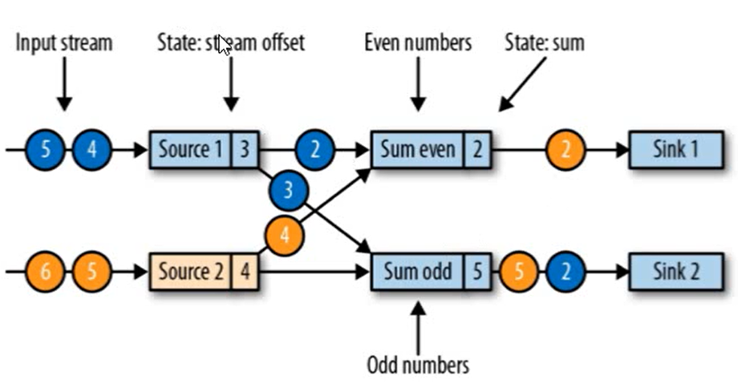

一个用两个输入流的应用程序，用并行的两个source任务来读取

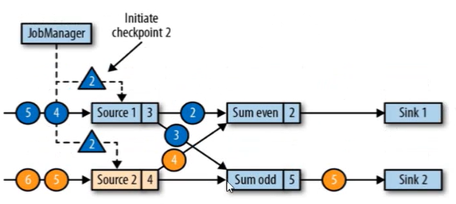

JobManager会向每个source任务发送一个带有新检查点ID的消息，通过这种方式来启动检查点。

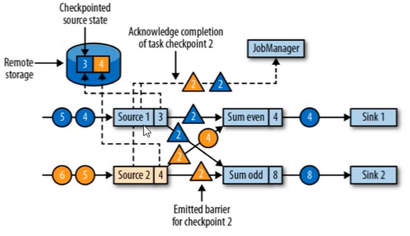

数据源将它们的状态写入检查点，并发出一个检查点barrier。

状态后端在状态存储检查点之后，会返回通知给sourc任务，source任务就会向jobManager确认检查点完成。

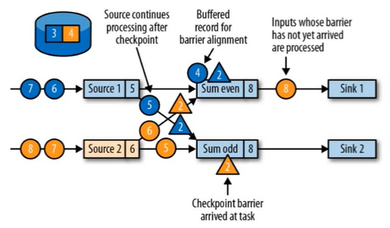

分界线对齐：barrier向下游传递，sum任务会等待所有输入分区的barrier到达。

对于barrier已经到达的分区，后续到达的数据会被缓存。

而barrier未到达的分区，数据会被正常处理。

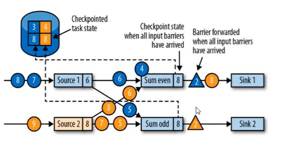

当收到所有输入分区的barrier时，任务就将其状态保存到状态后端的检查点中，然后将barrier继续向下游转发。

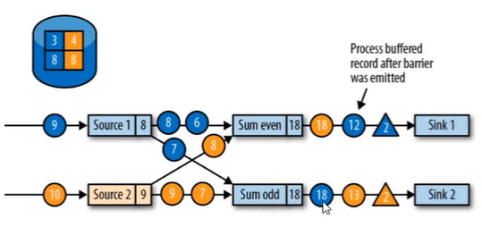

向下游转发检查点barrier后，任务继续正常的数据处理

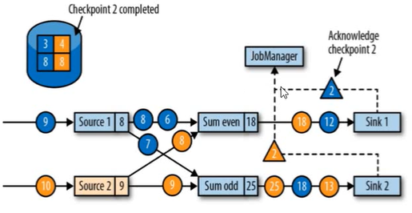

sink任务向jobManager确认状态保存到checkpoint完毕。

当所有任务都确认已成功将状态保存到检查点时，检查点就真正完成了。

### 保存点

savepoint

原理和checkpoint相同，需要用户手动设置保存点

### Flink状态一致性

计算结果要保证准确，一条数据不应该丢失，也不应该重复计算。

#### 分类

- AT-MOST-ONCE(最多一次)

既不恢复丢失的状态，也不重播丢失的数据

- AT-LEAST-ONCE(至少一次)

不丢失事件，所有事件都得到了处理，而一些事件还可能被处理多次

- EXACTLY-ONCE(精确一次，恰好一次)

不仅不丢失，内部状态也仅更新一次

#### 一致性检查点

轻量级快照机制----checkpoint

#### 端到端(end-to-end)状态一致性

内部保证--checkpiont

source端--可重设数据的读取位置

sink端--不会重复写入外部系统

- 幂等写入

可以重复执行很多次，但只导致一次结果改正。保证最终结果一致。

eg.HashMap

- 事务写入

实现思想：构建的事务对应着checkpoint，等到checkpoint真正完成的时候，才把所有对应的结果写入sink系统中。

实现方式：

1. 预写日志   WAL
2. 两阶段提交   2PC

#### WAL

简单易于实现，但是会增大延迟，不能完全保证。

DateStream API:GenericWriteAheadSink

#### 2PC

对于每个checkpoint，sink任务都会启动一个事务。

先预提交，当收到checkpoint完成的通知时，才正式提交事务。

TowPhaseCommitSinkFunction接口可实现

#### flink-kafka端到端状态一致性特征

- 内部--checkpoint
- source--将偏移量保存下来
- sink--采用两阶段提交sink，需要实现一个TowPhaProcessFunction

两段事务超时时间必须匹配
