## 1. 数组

**「数组（Array）」** 是一种很常见的数据结构。它由相同类型的元素（element）组成，并且是使用一块连续的内存来存储。

我们直接可以利用元素的索引（index）可以计算出该元素对应的存储地址。

数组的特点是：**「提供随机访问」** 并且容量有限。

```plain
假如数组的长度为 n。
访问：O（1）//访问特定位置的元素
插入：O（n）//最坏的情况发生在插入发生在数组的首部并需要移动所有元素时
删除：O（n）//最坏的情况发生在删除数组的开头发生并需要移动第一元素后面所有的元素时
```

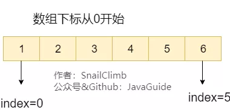

- 优点

  - 存储密度大（结点本身所占存储量/结点结构所站存储量）

  - 可以随机存储表中任一元素

- 缺点

  - 在插入、删除某一元素时，需要移动大量元素

  - 浪费存储空间

  - 属于静态存储形式，数据元素的个数不能自由扩充

## 2. 链表

### 2.1. 链表简介

**「链表（LinkedList）」** 虽然是一种线性表，但是并不会按线性的顺序存储数据，使用的不是连续的内存空间来存储数据。

链表的插入和删除操作的复杂度为 O(1) ，只需要知道目标位置元素的上一个元素即可。但是，在查找一个节点或者访问特定位置的节点的时候复杂度为 O(n) 。

使用链表结构可以克服数组需要预先知道数据大小的缺点，链表结构可以充分利用计算机内存空间,实现灵活的内存动态管理。但链表不会节省空间，相比于数组会占用更多的空间，因为链表中每个节点存放的还有指向其他节点的指针。除此之外，链表不具有数组随机读取的优点。

### 2.2. 链表分类

**「常见链表分类：」**

1. 单链表
2. 双向链表
3. 循环链表
4. 双向循环链表

```plain
假如链表中有n个元素。
访问：O（n）//访问特定位置的元素
插入删除：O（1）//必须要要知道插入元素的位置
```

#### 2.2.1. 单链表

**「单链表」** 单向链表只有一个方向，结点只有一个后继指针 next 指向后面的节点。因此，链表这种数据结构通常在物理内存上是不连续的。我们习惯性地把第一个结点叫作头结点，链表通常有一个不保存任何值的 head 节点(头结点)，通过头结点我们可以遍历整个链表。尾结点通常指向 null。

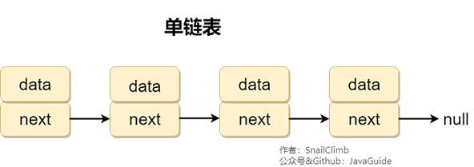

#### 2.2.2. 循环链表

**「循环链表」** 其实是一种特殊的单链表，和单链表不同的是循环链表的尾结点不是指向 null，而是指向链表的头结点。

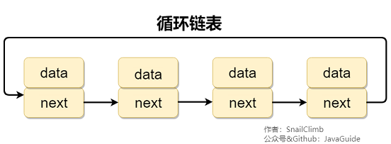

#### 2.2.3. 双向链表

**「双向链表」** 包含两个指针，一个 prev 指向前一个节点，一个 next 指向后一个节点。

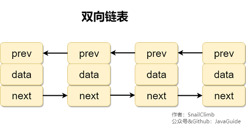

#### 2.2.4. 双向循环链表

**「双向循环链表」** 最后一个节点的 next 指向 head，而 head 的 prev 指向最后一个节点，构成一个环。

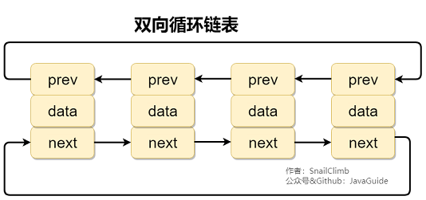

### 2.3. 应用场景

- 如果需要支持随机访问的话，链表没办法做到。如
- 果需要存储的数据元素的个数不确定，并且需要经常添加和删除数据的话，使用链表比较合适。
- 如果需要存储的数据元素的个数确定，并且不需要经常添加和删除数据的话，使用数组比较合适。

### 2.4. 数组 vs 链表

- 数据支持随机访问，而链表不支持。
- 数组使用的是连续内存空间对 CPU 的缓存机制友好，链表则相反。
- 数据的大小固定，而链表则天然支持动态扩容。如果声明的数组过小，需要另外申请一个更大的内存空间存放数组元素，然后将原数组拷贝进去，这个操作是比较耗时的！

## 3. 栈

### 3.1. 栈简介

**「栈」** (stack)只允许在有序的线性数据集合的一端（称为栈顶 top）进行加入数据（push）和移除数据（pop）。因而按照 **「后进先出（LIFO, Last In First Out）」** 的原理运作。**「在栈中，push 和 pop 的操作都发生在栈顶。」**

栈常用一维数组或链表来实现，用数组实现的队列叫作 **「顺序栈」** ，用链表实现的队列叫作 **「链式栈」** 。

```plain
假设堆栈中有n个元素。
访问：O（n）//最坏情况
插入删除：O（1）//顶端插入和删除元素
```

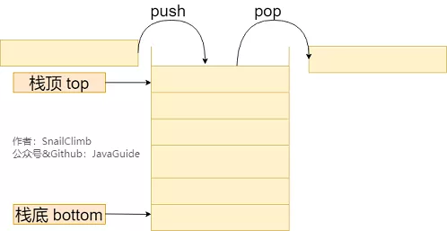

### 3.2. 栈的常见应用常见应用场景

当我们我们要处理的数据只涉及在一端插入和删除数据，并且满足 **「后进先出（LIFO, Last In First Out）」** 的特性时，我们就可以使用栈这个数据结构。

#### 3.2.1. 实现浏览器的回退和前进功能

我们只需要使用两个栈(Stack1 和 Stack2)和就能实现这个功能。比如你按顺序查看了 1,2,3,4 这四个页面，我们依次把 1,2,3,4 这四个页面压入 Stack1 中。当你想回头看 2 这个页面的时候，你点击回退按钮，我们依次把 4,3 这两个页面从 Stack1 弹出，然后压入 Stack2 中。假如你又想回到页面 3，你点击前进按钮，我们将 3 页面从 Stack2 弹出，然后压入到 Stack1 中。示例图如下:


#### 3.2.2. 检查符号是否成对出现

> 给定一个只包括 `'('`，`')'`，`'{'`，`'}'`，`'['`，`']'` 的字符串，判断该字符串是否有效。
>
> 有效字符串需满足：
>
> 1. 左括号必须用相同类型的右括号闭合。
> 2. 左括号必须以正确的顺序闭合。
>
> 比如 "()"、"()[]{}"、"{[]}" 都是有效字符串，而 "(]" 、"([)]" 则不是。

这个问题实际是 Leetcode 的一道题目，我们可以利用栈 `Stack` 来解决这个问题。

1. 首先我们将括号间的对应规则存放在 `Map` 中，这一点应该毋容置疑；
2. 创建一个栈。遍历字符串，如果字符是左括号就直接加入`stack`中，否则将`stack`的栈顶元素与这个括号做比较，如果不相等就直接返回 false。遍历结束，如果`stack`为空，返回 `true`。

```java
public boolean isValid(String s){
    // 括号之间的对应规则
    HashMap<Character, Character> mappings = new HashMap<Character, Character>();
    mappings.put(')', '(');
    mappings.put('}', '{');
    mappings.put(']', '[');
    Stack<Character> stack = new Stack<Character>();
    char[] chars = s.toCharArray();
    for (int i = 0; i < chars.length; i++) {
        if (mappings.containsKey(chars[i])) {
            char topElement = stack.empty() ? '#' : stack.pop();
            if (topElement != mappings.get(chars[i])) {
                return false;
            }
        } else {
            stack.push(chars[i]);
        }
    }
    return stack.isEmpty();
}
```

#### 3.2.3. 反转字符串

将字符串中的每个字符先入栈再出栈就可以了。

#### 3.2.4. 维护函数调用

最后一个被调用的函数必须先完成执行，符合栈的 **「后进先出（LIFO, Last In First Out）」** 特性。

### 3.3. 栈的实现

栈既可以通过数组实现，也可以通过链表来实现。不管基于数组还是链表，入栈、出栈的时间复杂度都为 O(1)。

下面我们使用数组来实现一个栈，并且这个栈具有`push()`、`pop()`（返回栈顶元素并出栈）、`peek()` （返回栈顶元素不出栈）、`isEmpty()`、`size()`这些基本的方法。

提示：每次入栈之前先判断栈的容量是否够用，如果不够用就用`Arrays.copyOf()`进行扩容；

```java
public class MyStack {
    private int[] storage;//存放栈中元素的数组
    private int capacity;//栈的容量
    private int count;//栈中元素数量
    private static final int GROW_FACTOR = 2;
    //不带初始容量的构造方法。默认容量为8
    public MyStack() {
        this.capacity = 8;
        this.storage=new int[8];
        this.count = 0;
    }
    //带初始容量的构造方法
    public MyStack(int initialCapacity) {
        if (initialCapacity < 1)
            throw new IllegalArgumentException("Capacity too small.");
        this.capacity = initialCapacity;
        this.storage = new int[initialCapacity];
        this.count = 0;
    }
    //入栈
    public void push(int value) {
        if (count == capacity) {
            ensureCapacity();
        }
        storage[count++] = value;
    }
    //确保容量大小
    private void ensureCapacity() {
        int newCapacity = capacity * GROW_FACTOR;
        storage = Arrays.copyOf(storage, newCapacity);
        capacity = newCapacity;
    }
    //返回栈顶元素并出栈
    private int pop() {
        if (count == 0)
            throw new IllegalArgumentException("Stack is empty.");
        count--;
        return storage[count];
    }
    //返回栈顶元素不出栈
    private int peek() {
        if (count == 0){
            throw new IllegalArgumentException("Stack is empty.");
        }else {
            return storage[count-1];
        }
    }
    //判断栈是否为空
    private boolean isEmpty() {
        return count == 0;
    }
    //返回栈中元素的个数
    private int size() {
        return count;
    }
}
```

验证

```java
MyStack myStack = new MyStack(3);
myStack.push(1);
myStack.push(2);
myStack.push(3);
myStack.push(4);
myStack.push(5);
myStack.push(6);
myStack.push(7);
myStack.push(8);
System.out.println(myStack.peek());//8
System.out.println(myStack.size());//8
for (int i = 0; i < 8; i++) {
    System.out.println(myStack.pop());
}
System.out.println(myStack.isEmpty());//true
myStack.pop();//报错：java.lang.IllegalArgumentException: Stack is empty.
```

## 4. 队列

### 4.1. 队列简介

**「队列」** 是 **「先进先出( FIFO，First In, First Out)」** 的线性表。在具体应用中通常用链表或者数组来实现，用数组实现的队列叫作 **「顺序队列」** ，用链表实现的队列叫作 **「链式队列」** 。**「队列只允许在后端（rear）进行插入操作也就是 入队 enqueue，在前端（front）进行删除操作也就是出队 dequeue」**

队列的操作方式和堆栈类似，唯一的区别在于队列只允许新数据在后端进行添加。

```plain
假设队列中有n个元素。
访问：O（n）//最坏情况
插入删除：O（1）//后端插入前端删除元素
```

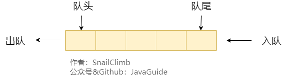

### 4.2. 队列分类

#### 4.2.1. 单队列

单队列就是常见的队列, 每次添加元素时，都是添加到队尾。单队列又分为 **「顺序队列（数组实现）」** 和 **「链式队列（链表实现）」**。

**「顺序队列存在“假溢出”的问题也就是明明有位置却不能添加的情况。」**

假设下图是一个顺序队列，我们将前两个元素 1,2 出队，并入队两个元素 7,8。当进行入队、出队操作的时候，front 和 rear 都会持续往后移动，当 rear 移动到最后的时候,我们无法再往队列中添加数据，即使数组中还有空余空间，这种现象就是 **「”假溢出“」** 。除了假溢出问题之外，如下图所示，当添加元素 8 的时候，rear 指针移动到数组之外（越界）。

> 为了避免当只有一个元素的时候，队头和队尾重合使处理变得麻烦，所以引入两个指针，front 指针指向对头元素，rear 指针指向队列最后一个元素的下一个位置，这样当 front 等于 rear 时，此队列不是还剩一个元素，而是空队列。——From 《大话数据结构》


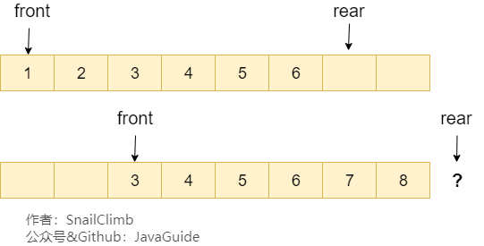

顺序队列假溢出

#### 4.2.2. 循环队列

循环队列可以解决顺序队列的假溢出和越界问题。解决办法就是：从头开始，这样也就会形成头尾相接的循环，这也就是循环队列名字的由来。

还是用上面的图，我们将 rear 指针指向数组下标为 0 的位置就不会有越界问题了。当我们再向队列中添加元素的时候， rear 向后移动。

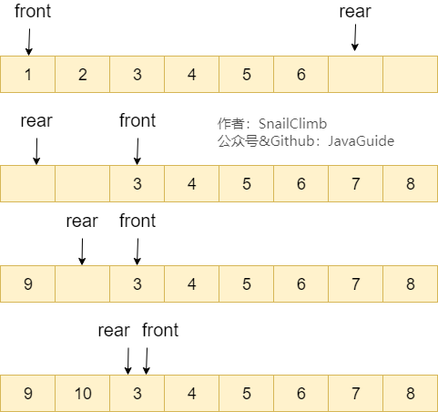

循环队列

顺序队列中，我们说 `front==rear` 的时候队列为空，循环队列中则不一样，也可能为满，如上图所示。解决办法有两种：

1. 可以设置一个标志变量 `flag`,当 `front==rear` 并且 `flag=0` 的时候队列为空，当`front==rear` 并且 `flag=1` 的时候队列为满。
2. 队列为空的时候就是 `front==rear` ，队列满的时候，我们保证数组还有一个空闲的位置，rear 就指向这个空闲位置，如下图所示，那么现在判断队列是否为满的条件就是：`(rear+1) % QueueSize= front` 。

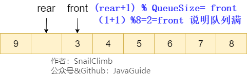

循环队列-队满

### 4.3. 常见应用场景

当我们需要按照一定顺序来处理数据的时候可以考虑使用队列这个数据结构。

- **「阻塞队列：」** 阻塞队列可以看成在队列基础上加了阻塞操作的队列。当队列为空的时候，出队操作阻塞，当队列满的时候，入队操作阻塞。使用阻塞队列我们可以很容易实现“生产者 - 消费者“模型。
- **「线程池中的请求/任务队列：」** 线程池中没有空闲线程时，新的任务请求线程资源时，线程池该如何处理呢？答案是将这些请求放在队列中，当有空闲线程的时候，会循环中反复从队列中获取任务来执行。队列分为无界队列(基于链表)和有界队列(基于数组)。无界队列的特点就是可以一直入列，除非系统资源耗尽，比如 ：`FixedThreadPool` 使用无界队列 `LinkedBlockingQueue`。但是有界队列就不一样了，当队列满的话后面再有任务/请求就会拒绝，在 Java 中的体现就是会抛出`java.util.concurrent.RejectedExecutionException` 异常。
- Linux 内核进程队列（按优先级排队）
- 实现生活中的派对，播放器上的播放列表;
- 消息队列
- 等等......

## 5. 图

图是一种较为复杂的非线性结构。**「为啥说其较为复杂呢？」**

根据前面的内容，我们知道：

- 线性数据结构的元素满足唯一的线性关系，每个元素(除第一个和最后一个外)只有一个直接前趋和一个直接后继。
- 树形数据结构的元素之间有着明显的层次关系。

但是，树形结构的元素之间的关系是任意的。

**「何为图呢？」** 简单来说，图就是由顶点的有穷非空集合和顶点之间的边组成的集合。通常表示为：**「G(V,E)」**，其中，G 表示一个图，V 表示顶点的集合，E 表示边的集合。

下图所展示的就是图这种数据结构，并且还是一张有向图。

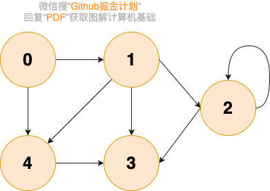

图在我们日常生活中的例子很多！比如我们在社交软件上好友关系就可以用图来表示。

## 图的基本概念

### 顶点

图中的数据元素，我们称之为顶点，图至少有一个顶点（非空有穷集合）

对应到好友关系图，每一个用户就代表一个顶点。

### 边

顶点之间的关系用边表示。

对应到好友关系图，两个用户是好友的话，那两者之间就存在一条边。

### 度

度表示一个顶点包含多少条边，在有向图中，还分为出度和入度，出度表示从该顶点出去的边的条数，入度表示进入该顶点的边的条数。

对应到好友关系图，度就代表了某个人的好友数量。

### 无向图和有向图

边表示的是顶点之间的关系，有的关系是双向的，比如同学关系，A 是 B 的同学，那么 B 也肯定是 A 的同学，那么在表示 A 和 B 的关系时，就不用关注方向，用不带箭头的边表示，这样的图就是无向图。

有的关系是有方向的，比如父子关系，师生关系，微博的关注关系，A 是 B 的爸爸，但 B 肯定不是 A 的爸爸，A 关注 B，B 不一定关注 A。在这种情况下，我们就用带箭头的边表示二者的关系，这样的图就是有向图。

### 无权图和带权图

对于一个关系，如果我们只关心关系的有无，而不关心关系有多强，那么就可以用无权图表示二者的关系。

对于一个关系，如果我们既关心关系的有无，也关心关系的强度，比如描述地图上两个城市的关系，需要用到距离，那么就用带权图来表示，带权图中的每一条边一个数值表示权值，代表关系的强度。

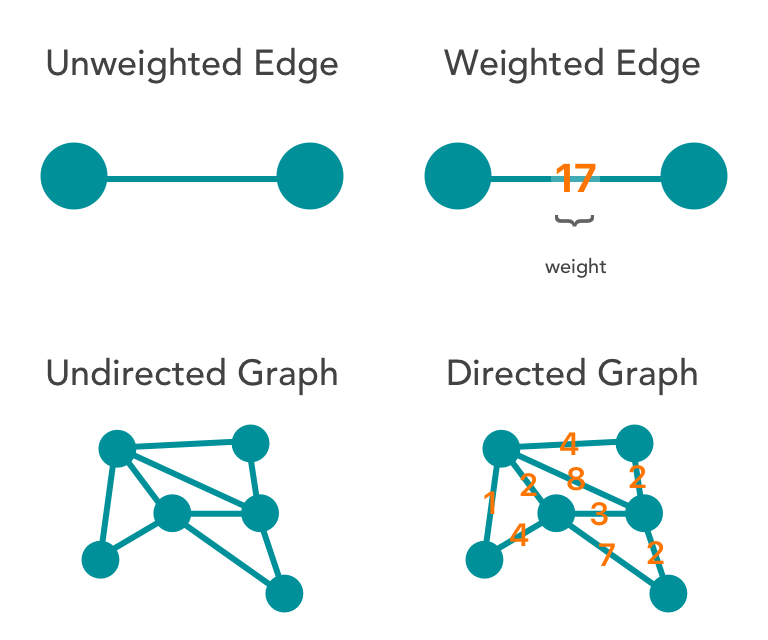img

## 图的存储

### 邻接矩阵存储

邻接矩阵将图用二维矩阵存储，是一种较为直观的表示方式。

如果第 i 个顶点和第 j 个顶点之间有关系，且关系权值为 n，则 `A[i][j]=n`。

在无向图中，我们只关心关系的有无，所以当顶点 i 和顶点 j 有关系时，`A[i][j]`=1，当顶点 i 和顶点 j 没有关系时，`A[i][j]`=0。如下图所示：

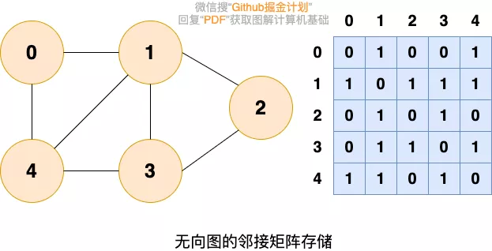

值得注意的是：**「无向图的邻接矩阵是一个对称矩阵，因为在无向图中，顶点 i 和顶点 j 有关系，则顶点 j 和顶点 i 必有关系。」**

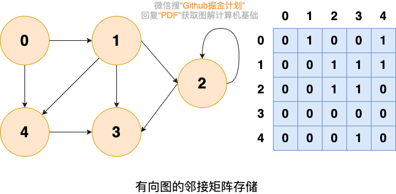

邻接矩阵存储的方式优点是简单直接（直接使用一个二维数组即可），并且，在获取两个定点之间的关系的时候也非常高效（直接获取指定位置的数组元素的值即可）。但是，这种存储方式的缺点也比较明显，那就是比较浪费空间，

### 邻接表存储

针对上面邻接矩阵比较浪费内存空间的问题，诞生了图的另外一种存储方法—**「邻接表」** 。

邻接链表使用一个链表来存储某个顶点的所有后继相邻顶点。对于图中每个顶点 Vi，把所有邻接于 Vi 的顶点 Vj 链成一个单链表，这个单链表称为顶点 Vi 的**「邻接表」**。如下图所示：

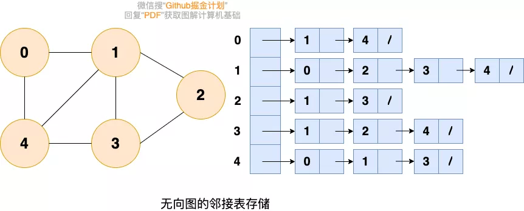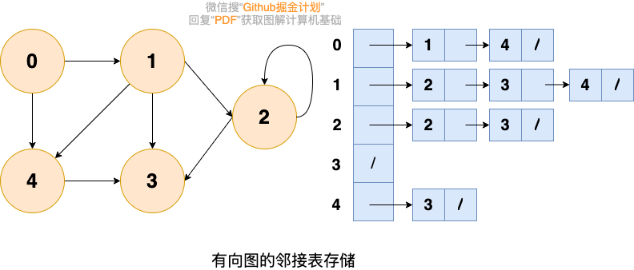

大家可以数一数邻接表中所存储的元素的个数以及图中边的条数，你会发现：

- 在无向图中，邻接表元素个数等于边的条数的两倍，如左图所示的无向图中，边的条数为 7，邻接表存储的元素个数为 14。
- 在有向图中，邻接表元素个数等于边的条数，如右图所示的有向图中，边的条数为 8，邻接表存储的元素个数为 8。

## 图的搜索

### 广度优先搜索

广度优先搜索就像水面上的波纹一样一层一层向外扩展，如下图所示：

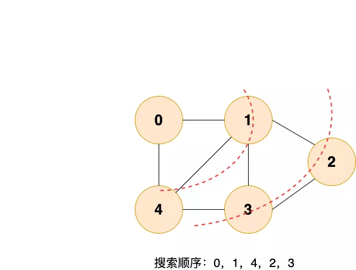

**「广度优先搜索的具体实现方式用到了之前所学过的线性数据结构——队列」** 。具体过程如下图所示：

**「第 1 步：」**

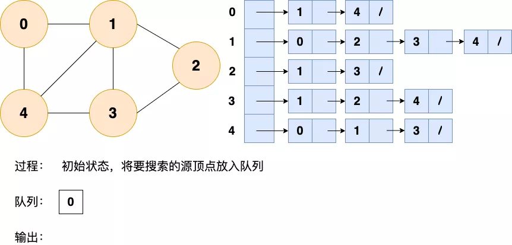

**「第 2 步：」**

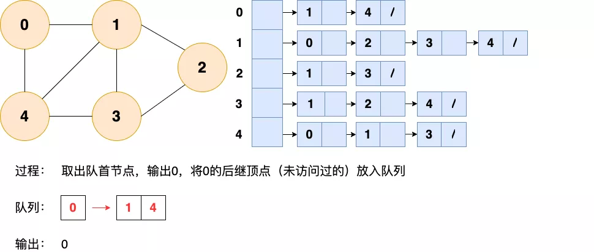

**「第 3 步：」**

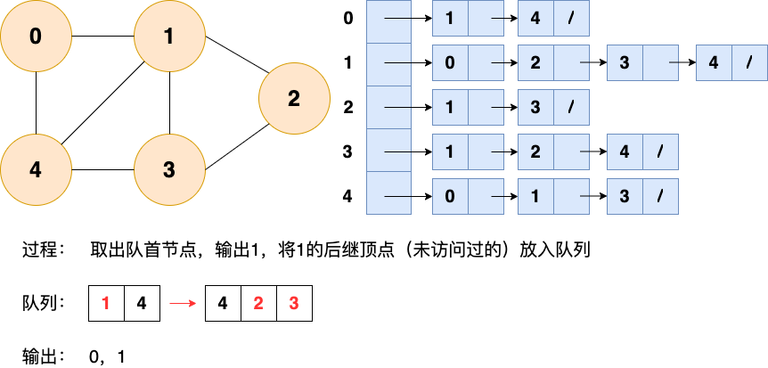

**「第 4 步：」**

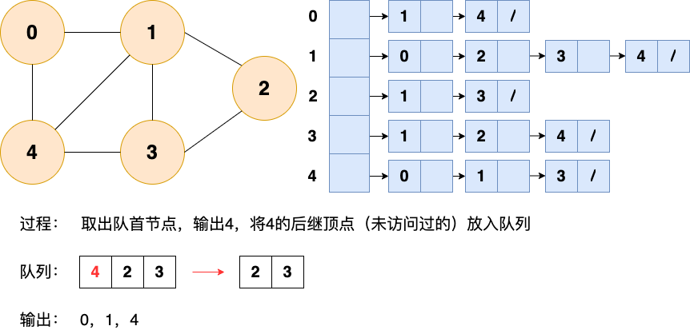

**「第 5 步：」**

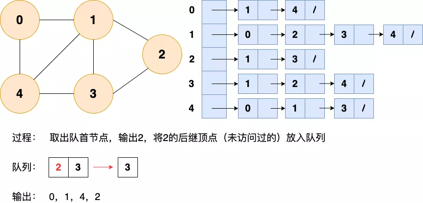

**「第 6 步：」**

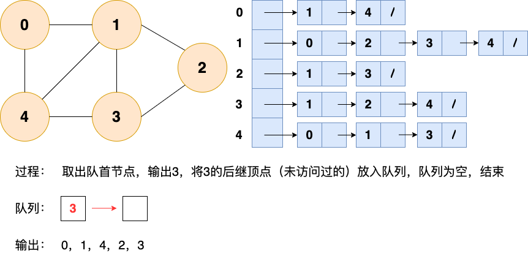

### 深度优先搜索

深度优先搜索就是“一条路走到黑”，从源顶点开始，一直走到没有后继节点，才回溯到上一顶点，然后继续“一条路走到黑”，如下图所示：

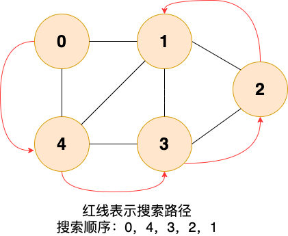

**「和广度优先搜索类似，深度优先搜索的具体实现用到了另一种线性数据结构——栈」** 。具体过程如下图所示：

**「第 1 步：」**

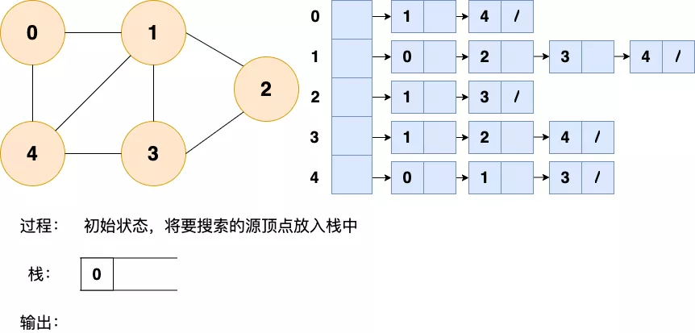

**「第 2 步：」**

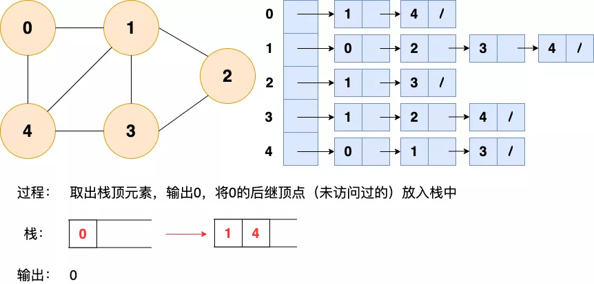

**「第 3 步：」**

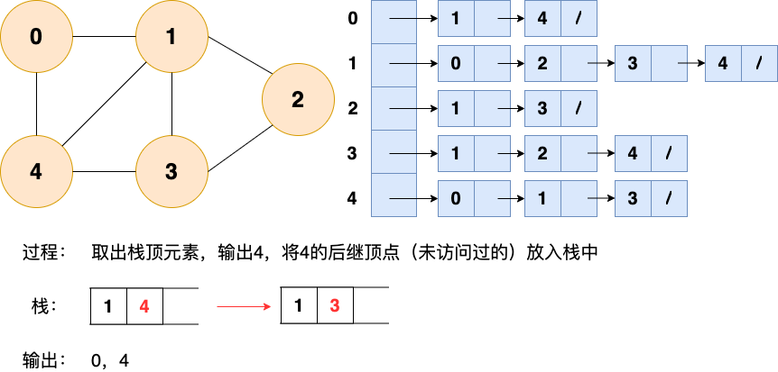

**「第 4 步：」**


**「第 5 步：」**

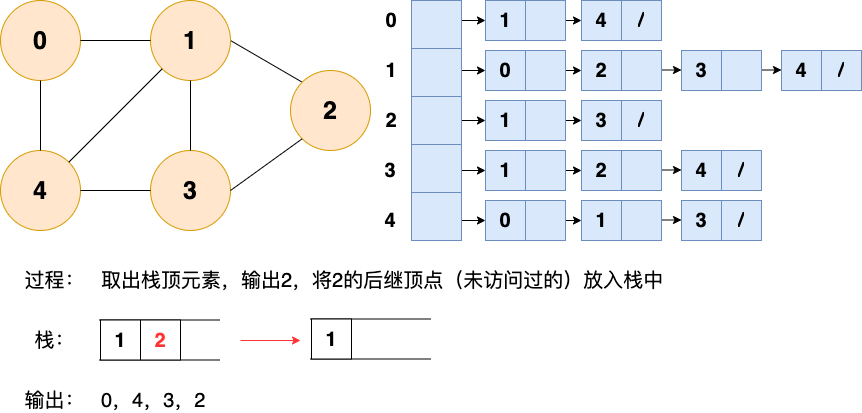

**「第 6 步：**

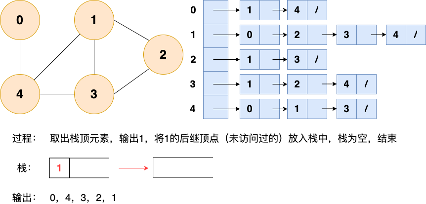
