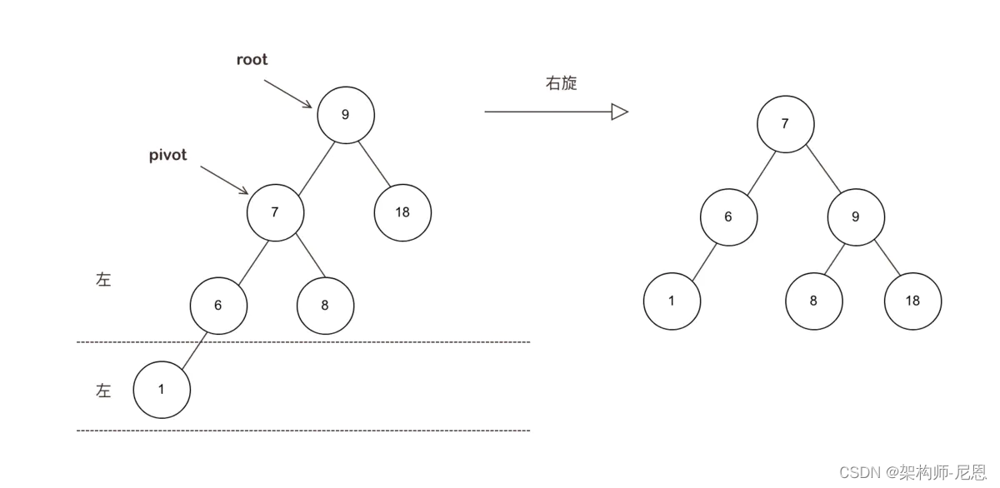
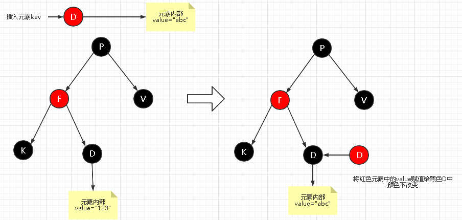
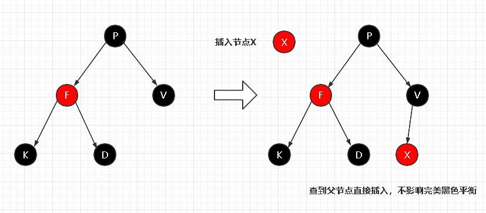
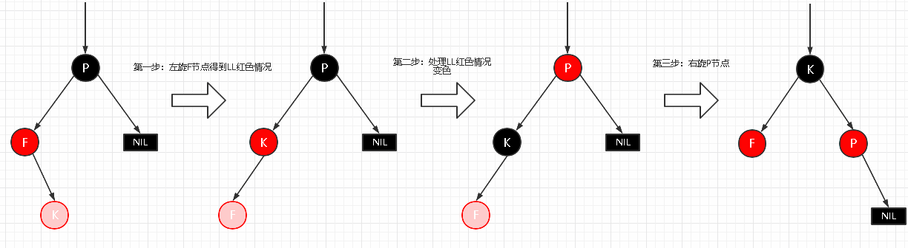
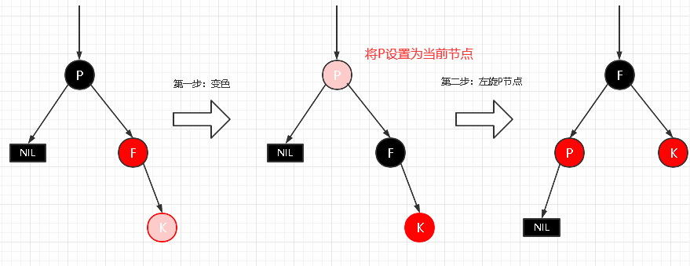

## 红黑树为何必须掌握

先来看看，红黑树的广泛应用：

- JDK1.8 开始，HashMap 也引入了红黑树：当冲突的链表长度超过 8 时，自动转为红黑树。
- Java中，TreeMap、TreeSet都使用红黑树作为底层数据结构。
- Linux底层的 CFS 进程调度算法中，vruntime 使用红黑树进行存储。
- 多路复用技术的 Epoll，其核心结构是红黑树 + 双向链表。

### 

> 本文，从 BST二叉查找树，到 AVL 平衡二叉树，再到 RBT 红黑树，
>
> 为大家做好**清晰的场景分析**，帮助大家记忆。

## BST 二叉搜索树

### 什么是二叉搜索树呢？

二叉搜索树（BST）具备以下特性：

1. 左子树上所有结点的值均小于或等于它的根结点的值。
2. 右子树上所有结点的值均大于或等于它的根结点的值。
3. 左、右子树也分别为二叉排序树。

### 二叉搜索树 BST 的完美情况

一般人们理解的二叉树（**又叫二叉搜索树 BST**）会出现一个问题，完美的情况下，它是这样的：


### 二叉搜索树的查找流程

如何查找值为 7 的节点？

1. 查看根节点 8，因为 7 < 8，所以再查看它的左子节点 6；
2. 查看左子节点 6，因为 7 > 6，所以再查看它的右子节点 7；
3. 查看右子节点 7，因为 7 = 7，所以就找到啦。

### 二叉搜索树的极端情况

二叉查找树是有缺点的，在不断插入的时候，**有可能出现这样一种情况：**很容易“退化”成链表，

如果 BST 树的节点正好从大到小的插入，此时树的结构也类似于链表结构，这时候的查询或写入耗时与链表相同。

**退化成为了链表的特殊BST**

一课特殊 BST，退化成为了链表，如下图：


它和链表一样，搜索的时候，最坏情况的时间复杂度 O(n) 。

**那么我们怎么避免这种情况呢？**

为了避免这种特殊的情况发生，引入了平衡二叉树（AVL）和红黑树（red-black tree）。

AVL、RBT 都是通过本身的建树原则来控制树的层数和节点位置，

因为 RBT 是由 AVL 演变而来，所以我们从了解 AVL 开始。

## AVL 平衡二叉树

平衡二叉树也叫 AVL（得名于它的发明者 G. M. Adelson-Velsky 和 Evgenii Landis，他们在1962年的论文《An algorithm for the organization of information》中公开了这一数据结构），也属于二叉搜索树的一种，与其不同的是AVL通过机制保证其自身的平衡。

> AVL 树是最先发明的自平衡二叉查找树。
>
> 在 AVL 树中任何节点的两个子树的高度最大差别为1，所以它也被称为高度平衡树。
>
> 增加和删除可能需要通过一次或多次树旋转来重新平衡这个树。

### AVL 树的特性

AVL树本质上还是一棵二叉搜索树，它有以下特性：

- 特性1： 对于任何一颗子树的 root 根结点而言，它的左子树任何节点的key一定比 root 小，而右子树任何节点的 key 一定比 root 大；
- 特性2：对于 AVL 树而言，其中任何子树仍然是 AVL 树；
- 特性3：每个节点的左右子节点的高度之差的绝对值最多为1；

> 特性1表明，AVL 继承于 BST ,所以:
>
> 1. AVL 本身首先是一棵 BST 二叉搜索树。
> 2. AVL 带有平衡条件：每个结点的左右子树的高度之差的绝对值（平衡因子）最多为1。

在插入、删除树节点的时候，如果破坏了以上的原则，**AVL 树会自动进行调整**使得以上三条原则仍然成立。

也就是说，AVL 树，本质上是**带了平衡功能的二叉查找树**（二叉排序树，二叉搜索树）。

### AVL 树的平衡功能

举个例子，下左图为 AVL 树最长的2节点与最短的8节点高度差为1；

当插入一个新的节点后，根据上面第一条原则，它会出现在2节点的左子树，但这样一来就违反了原则3。


此时 AVL 树会通过节点的旋转进行进行平衡，

AVL 调整的过程称之为左旋和右旋，

### AVL 平衡的调整过程

**旋转之前，首先确定旋转支点（pivot）：** 这个旋转支点就是失去平衡这部分树，在自平衡之后的根节点，

平衡的调整过程，需要根据pivot它来进行旋转。

我们在学习 AVL 树的旋转时，不要将失衡问题扩大到整个树来看，这样会扰乱你的思路，

我们只关注**失衡子树的根结点** 及它的子节点和孙子节点即可。

事实上，AVL 树的旋转，我们权且叫“AVL 旋转”是有规律可循的，因为只要聚焦到**失衡子树，**然后进行左旋、右旋即可。

> 很多人在左旋和右旋有时候弄不明白，
>
> 其实左旋就是逆时针转，右旋是顺时针转。

## AVL 子树失衡的四大场景

导致 AVL 失衡的场景就是有限的4个：

- 左左结构失衡（LL 型失衡）
- 右右结构失衡（RR 型失衡）
- 左右结构失衡（LR 型失衡）
- 右左结构失衡（RL 型失衡）

删除元素，也会导致 AVL 失衡，需要再平衡，但是原理和插入元素是类似的。

这里聚焦 介绍插入元素的平衡过程，删除元素，不做介绍。

### 场景1:LL 型失衡-左左结构失衡（右旋）：

> 场景：插入的元素在子树 root 的左侧不平衡元素的左侧。
>
> 此时，以 root 的左子节点为支点，也就是，左侧的不平衡元素为 pivot (支点),进行右旋。


来一个右旋的动画：


> 右旋过程中，如果 pivot 有右子树，则作为原 root 的左子树，保障 AVL 的特性1

#### 记忆要点

LL 型失衡怎么平衡呢？

> 旋转的反向，与失衡的方向相反，
>
> LL 型失衡，与左边相反的方向，是右边，所以是右旋

### 场景2 RR 型失衡：右右结构失衡（左旋）

> 场景：插入的元素在子树 root 右侧的不平衡子树的右侧
>
> 此时，以 root 的右儿为支点，也就是，右侧的不平衡元素 为 pivot(支点)， 进行左旋


来一个左旋的动画：


> 左旋过程中，如果pivot有左子树，则作为 原root的 右子树，
>
> 保障AVL的特性1，

#### 记忆要点

RR型失衡怎么 平衡呢？

> 旋转的反向，**与失衡的方向相反**，
>
> RR 型失衡，与右边 相反的方向， 是左边，所以是左旋

### 场景3 LR 型失衡：左右结构失衡（左旋+右旋）：

> 场景： 插入的元素在左侧的不平衡元素的右侧


#### 记忆要点

LR 型失衡怎么 平衡呢？

> 旋转的反向，**与失衡的方向相反**，
>
> LR型失衡，与只相反的方向是 RL，但是先旋转底部，再旋转顶部，RL进行次序颠倒，LR
>
> 所以， LR型失衡，旋转的方式，是先左旋， 再右旋

### 场景4 RL 失衡: 右左结构 （右旋+左旋）：

场景： 插入的元素在右侧的不平衡元素的左侧


#### 记忆要点

尼恩备注记忆要点，RL型失衡怎么 平衡呢？

> 旋转的反向，**与失衡的方向相反**，
>
> RL型失衡，与只相反的方向是 LR，但是先旋转底部，再旋转顶部，所以，LR 进行次序颠倒，RL；
>
> 最终， RL型失衡，旋转的方式，是先右旋， 再左旋。

### AVL 树平衡总结

可见无论哪种情况的失衡，都可以通过旋转来调整。

不难看出，旋转在图上像是将 pivot (支点)节点向上提（将它提升为 root 节点），而后两边的节点会物理的分布在新 root 节点的两边，

接下来按照 AV L二叉树的要求：

> 左子树小于 root，右子树大于 root 进行调整。

从图LL结构可以看出，当右旋时原来pivot（7）的右子树（8）会转变到原root点（9）的左子树处；



从图右右结构可见，当左旋时，原来pivot（18）的左子树会分布到原root点（9）的右子树。


对于左右结构和右左结构无非是经过多次旋转达到稳定，旋转的方式并没有区别，

AVL 树本质上还是一棵**二叉搜索树**，它有以下特性：
1.本身首先是一棵二叉搜索树。
2.带有平衡条件：每个结点的左右子树的高度之差的绝对值（平衡因子）最多为1。

也就是说，AVL 树，本质上是**带了平衡功能的二叉查找树**（二叉排序树，二叉搜索树）。

### AVL树的删除

**删除的判断标准**

1. 要删除的节点是什么类型的节点？；
2. 删除后是否会破坏平衡 ；

**节点类型**

1. 叶子节点；
2. 节点只有左子树或只有右子树 ；
3. 既有左右子树都有。

**处理的思路**

1. 当删除为叶子节点，则直接删除，并从父亲节点开始往上看，判断是否失衡；如果没有失衡，再判断父亲的父节点是否失衡，直到根节点。若失衡则判断失衡类型（LL、LR、RR、RL），再进行相应的调整。
2. 删除的节点只有左子树或只有右子树，那么将节点删除，以左子树或右子树进行代替，并进行相应的平衡判断，若失衡则调整，一直到根节点 ；
3. 删除的节点既有左子树又有右子树，找到其前驱或者后驱节点将其替换，再判断是否失衡，然后根据失衡情况调整，直到根节点。

## 常见AVL面试题

### 问：什么是AVL左旋和右旋？

> 加入节点后，左旋和右旋 ，维护AVL平衡性

右旋转

场景： 插入的元素在不平衡元素的左侧的左侧

> x.right = y
>
> y.left = xxx(原x.right)

```javascript
   对节点y进行向右旋转操作，返回旋转后新的根节点x
            y                             x
           / \                          /   \
          x   T4     向右旋转 (y)        z     y
         / \       - - - - - - - ->    / \   / \
        z   T3                       T1  T2 T3 T4
       / \
     T1   T2
```

> 场景：插入的元素在不平衡元素的右侧的右侧
>
> // 向左旋转过程
>
> x.left = y;
>
> y.right =(原x.left )

```javascript
对节点y进行向左旋转操作，返回旋转后新的根节点x
        y                             x
      /  \                          /   \
     T1   x      向左旋转 (y)       y     z
         / \   - - - - - - - ->   / \   / \
       T2  z                     T1 T2 T3 T4
          / \
         T3 T4
```

### AVL树的问题

既然AVL树可以保证二叉树的平衡，这就意味着AVL搜索的时候，它最坏情况的时间复杂度O(logn) ，要低于普通二叉树BST和链表的最坏情况O(n)。

那么HashMap直接使用AVL树来替换链表就好了，为什么选择用红黑树呢？

原因是：

由于AVL树必须保证左右子树平衡，Max(最大树高-最小树高) <= 1，

所以在插入的时候很容易出现不平衡的情况，一旦这样，就需要进行旋转以求达到平衡。

正是由于这种严格的平衡条件，导致AVL需要花大量时间在调整上，故AVL树一般使用场景在于**查询场景**， 而不是 **增加删除 频繁**的场景。

**红黑树(rbt)做了什么优化呢？**

红黑树(rbt)继承了AVL可自平衡的优点，

同时, 红黑树(rbt)在**查询速率和平衡调整**中寻找平衡，放宽了**树的平衡条件**，从而可以用于 **增加删除 频繁**的场景。

在实际应用中，红黑树的使用要多得多。

## 红黑树（RBTree）

红黑树是一种特化的 AVL 树，它是在1972年由 Rudolf Bayer 发明的，当时被称为平衡二叉B树（symmetric binary B-tree）。在 1978 年被 Leo J.Guibas 和 Robert Sedgewick 修改为如今的“红黑树”。

### 什么是红黑树？

红黑树也是一种自平衡二叉查找树，它与 AVL 树类似，都在添加和删除的时候通过旋转操作保持二叉树的平衡，已求更高效的查询性能。

与 AVL 树相比，红黑树牺牲了部分平衡性，以换取插入/删除操作时较少的旋转操作，整体来说性能要优于 AVL 树。

虽然红黑树是复杂的，但它的最坏情况运行时间也是非常良好的，并且在实践中是高效的：

> 它可以在 O(log n) 时间内做查找，插入和删除，这里的 n 是树中元素的数目。

### 红黑树的特性

红黑树是实际应用中最常用的平衡二叉查找树，它不严格的具有平衡属性，但平均的使用性能非常良好。

在红黑树中，节点被标记为红色和黑色两种颜色。

红黑树的原则有以下几点：

- 节点非黑即红；
- 根节点一定是黑色；
- 叶子结点一定是黑色（且都为NIL）；
- 每个红色节点的两个子节点都是黑色（从每个叶子结点到根结点的所有路径上不能有两个连续的红色节点）；
- 从任一节点到其每个叶子结点的所有路径，都包含相同数目的黑色节点。

红色属性说明，红色节点的子节点，一定是黑色。但是，黑色节点的子节点，可以是红色，也可以是黑色；

叶子属性说明，叶子结点是空的NIL，AVL 的叶子结点不是空的，具体见下图。


基于上面的原则，我们一般在插入红黑树节点的时候，会将这个结点设置为红色。参照最后一个原则：**红色破坏原则的可能性最小**，如果是黑色，很可能导致这条支路的黑色节点比其他支路的要多1个，破坏了平衡。

记忆要点：

可以按照括号里边的分类，记住红黑树的几个原则：

- （**颜色属性**）特性1：节点非黑即红；
- （**根属性**）特性2：根节点一定是黑色；
- （**叶子属性**）特性3：叶子节点（NIL）一定是黑色；
- （**红色属性**）特性4：每个红色节点的两个子节点，都是黑色。（从每个叶子结点到根节点的所有路径上不能有两个连续的红色节点）
- （**黑色属性**）特性5：从任一节点到其每个叶子的所有路径，都包含相同数目的黑色节点。

黑色属性，可以理解为**平衡特性**，如果满足不了平衡特征，就要进行平衡操作。

**空间换时间**

红黑树有点属于一种空间换时间类型的优化，在 AVL 的节点上，增加了**颜色属性**的数据，相当于增加了空间的消耗。通过颜色属性的增加，换取后面平衡操作的次数减少。

### 黑色完美平衡

红黑树并不是一棵 AVL 平衡二叉搜索树，从图上可以看到，根结点 P 的左子树显然比右子树高。根据红黑树的特性5，从任一节点到其每个叶子结点的所有路径，都包含相同数目的黑色节点，说明：

> 红黑树的左子树和右子树的黑色节点的层数是相等的。
>
> 红黑树的平衡条件，不是以整体的高度来约束的，而是以黑色节点的高度来约束的。


所以称红黑树的这种平衡为**黑色完美平衡**。

看看黑色完美平衡的效果，去掉红黑树中的红色节点，会得到一个四叉树，从根节点到每一个叶子结点，高度相同，就是红黑树的 Root 到叶子结点的黑色路径长度。


## 红黑树恢复平衡过程的三个操作

一旦红黑树 5 个原则有不满足的情况，我们视为平衡被大屏，如何恢复平衡呢？

靠它的三种操作：**变色、左旋、右旋**。

### 1. 变色

节点的颜色由红变黑或由黑变红。

### 2. 左旋

以某个节点作为支点（pivot），其父节点（子树的 Root）旋转作为自己的左子树（左旋），pivot 的原左子树变成原 Root 节点的右子树，pivot 的原右子树保持不变。


### 3. 右旋

以某个结点作为支点（pivot），其父节点（子树的 Root）旋转为自己的右子树（右旋），pivot 的原右子树变成原 Root 节点的左子树，pivot 的原左子树保持不变。


红黑树的左旋，右旋操作，和 AVL 树的左旋、右旋差不多。

## 红黑树插入节点情景分析

### 红黑树的节点结构

先看红黑树的节点结构，以 HashMap 中的红黑树的结构定义为例子：

``` java
  static class Node<K,V> implements Map.Entry<K,V> {
        final int hash;
        final K key;
        volatile V val;
        volatile Node<K,V> next;
        }


/**
 * Nodes for use in TreeBins
 */
static final class TreeNode<K,V> extends Node<K,V> {
    TreeNode<K,V> parent;  // red-black tree links
    TreeNode<K,V> left;
    TreeNode<K,V> right;
    TreeNode<K,V> prev;    // needed to unlink next upon deletion
    boolean red;

    TreeNode(int hash, K key, V val, Node<K,V> next,
             TreeNode<K,V> parent) {
        super(hash, key, val, next);
        this.parent = parent;
    }
```

默认新插入的节点为红色：

因为父节点为黑色的概率较大，插入新节点为红色，可以避免颜色冲突。

### 场景1：红黑树为空树

直接把插入节点作为根节点就可以了。

另外：根据红黑树性质2：根节点是黑色的，还需要把插入节点设置为黑色。

### 场景2： 插入节点的 Key 已经存在

更新当且节点的值为插入节点的值。



### 场景3：插入节点的父节点为黑色

由于插入的节点是红色的，当插入节点的父节点是黑色时，不会影响红黑树的平衡，所以：**直接插入无需做自平衡**。



### 场景4：插入节点的父节点为红色

根据性质2：根节点是黑色。如果插入节点的父节点为红色节点，那么该父节点不可能为根节点，所以插入节点总是存在祖父节点（三代关系）。

根据性质4：每个红色节点的两个子节点一定是黑色的，不能有两个红色节点相连。

此时会出现两种情况：

- 父节点和叔叔节点为红色；
- 父节点为红色，叔叔节点为黑色；

如下图所示：


#### 场景4.1：父节点和叔叔节点都为红色

根据性质4：红色节点不能相连，祖父节点肯定为黑色节点；父节点为红色，那么此时插入子树的红黑层数的情况是：黑红红。

因为不可能同时存在两个相连的红色节点，需要进行变色，显然处理方式是把其改为：红黑红。

**变色处理**：黑红红 --> 红黑红

1. 将 F 和 V 节点改为黑色；
2. 将 P 改为红色；
3. 将 P 设置为当前节点，进行后续处理。


可以看到，将 P 设置为红色了，如果 P 的父节点是黑色，那么无需做处理；但如果 P 的父节点是红色，则违反了红黑树性质了，所以需要将 P 设置为当且节点，继续插入操作，作自平衡处理，直到整体平衡为止。

#### 场景4.2：叔叔节点为黑色，父节点为红色，并且插在父节点的左子节点

分两种情况：

- LL 红色插入

叔叔为黑色，或者不存在（NIL）也是黑色节点，并且节点的父节点是祖父节点的左子节点。

注意：单纯从插入来看，叔叔节点非红即黑（NIL），否则破坏了红黑树性质5，此时路径会比其他路径多一个黑色节点。


##### 场景4.2.1 LL 型失衡

细分场景1：新插入节点，为其父节点的左子节点（LL 红色情况），插入后就是 LL型失衡。


自平衡处理：

1. 变色：将 F 设置为黑色，将 P 设置为红色。
2. 对 F 节点进行右旋。


##### 场景4.2.2 LR 型失衡

细分场景2：新插入节点，为其父节点的右子节点（LR红色情况），插入后就是 LR 型失衡。


自平衡处理：

1. 对 F 进行左旋；
2. 将 F 设置为当且节点，得到 LL 红色情况；
3. 按照 LL 红色情况处理。



#### 场景4.3 叔叔为黑色，父节点为红色，并且父节点是祖父节点的右子节点


##### 场景4.3.1：RR 型失衡

新插入节点，为其父节点的右子节点（RR 红色情况）


自平衡处理：

1. 变色：将 F 设置为黑色，将 P 设置为红色；
2. 对 P 节点进行左旋。



##### 场景4.3.2：RL 型失衡

新插入节点，为其父节点的左子节点（RL 红色情况）


自平衡处理：

1. 对 F 进行右旋；
2. 将 F 设置为当前节点，得到 RR 红色情况；
3. 按照 RR 红色情况处理。


## 红黑树面试题：

### 有了二叉搜索树，为什么还需要平衡二叉树？

二叉搜索树容易退化成一条链，这时，查找的时间复杂度从 O(log n) 也将退化成 O(N)。

引入对左右子树高度有限制的平衡二叉树 AVL，保证查找操作的最坏时间复杂度也为 O(log n)。

### 有了平衡二叉树，为什么还需要红黑树？

AVL 的左右子树高度差不能超过 1，每次进行插入/删除操作时，几乎都需要通过旋转操作保持平衡。在频繁进行插入/删除的场景中，频繁的旋转操作使得 AVL 的性能大打折扣。

红黑树通过牺牲严格的平衡，换取插入/删除时少量的旋转操作，整体性能优于 AVL：

- 红黑树插入时的不平衡，不超过两次选择就可以解决；删除时的不平衡，不超过三次选择就能解决。
- 红黑树的红黑规则，保证最坏的情况下，也能在 O(log n)时间内完成查找操作。

### 红黑树那几个原则，你还记得吗？

- （颜色属性）节点非黑即红；
- （根属性）根节点一定是黑色；
- （叶子属性）叶子节点（NIL）一定是黑色；
- （红色属性）每个红色节点的两个子节点都是黑色。（从每个叶子节点到根节点的路径上不能有两个连续的红色节点）；
- （黑色属性）从任一节点到其每个叶子结点的路径，都包含相同数目的黑色节点。

### 红黑树写入操作，是如何找到他的父节点的？

红黑树的节点 TreeNode 他就是继承 Node 结构的。

先看看红黑树的节点结构，以 HashMap 中的红黑树的结构定义为例子：

```java
  static class Node<K,V> implements Map.Entry<K,V> {
        final int hash;
        final K key;
        volatile V val;
        volatile Node<K,V> next;
        }


/**
 * Nodes for use in TreeBins
 */
static final class TreeNode<K,V> extends Node<K,V> {
    TreeNode<K,V> parent;  // red-black tree links
    TreeNode<K,V> left;
    TreeNode<K,V> right;
    TreeNode<K,V> prev;    // needed to unlink next upon deletion
    boolean red;

    TreeNode(int hash, K key, V val, Node<K,V> next,
             TreeNode<K,V> parent) {
        super(hash, key, val, next);
        this.parent = parent;
    }
```

TreeNode 在 Node 基础上加了几个字段，分别指向父节点 parent，然后指向左子节点 left，右子节点 right，还有表示颜色的 red 属性。

**红黑树插入操作：**

首先是找到一个合适的插入点，即找到插入节点的父节点，由于红黑树满足 BST 二叉查找树的有序特性，这个找父节点的操作和二叉查找树是完全一致的。

二叉查找树，左子节点小于当前节点，右子节点大于当前节点，每一次向下查找一层就可以排除掉一半的数据，查找的效率在 O(log n)，最终查找到 NIL 节点或者 key 一样的节点。

如果最终查找到 key 一样的节点，进行更新操作。这个 TreeNode.key 与当前 put.key 完全一致。这就不需要插入，替换 value 就可以了，父节点就是当前节点的父节点。

如果最终查找到 NIL 节点，进行插入操作。NIL 节点的父节点，就是当前节点的父节点，把插入的节点替换 NIL 节点，然后进行红黑树的平衡处理。

### 红黑树有哪些内部操作

变色：把一个红色节点变成黑色，或者把一个黑色的节点变成红色，就是对这个节点的变色。

旋转：与平衡二叉树的选择操作类似。

### 红黑树与 AVL 树的区别

**1、调整平衡的实现机制不同**

红黑树根据路径上黑色节点数目一致，来确定是否失衡，如果失衡，就通过变色和旋转来恢复；

AVL 根据树的平衡因子(**所有节点的左右子树高度差的绝对值不超过1**)，来确定是否失衡，如果失衡，就通过旋转来恢复。

**2、红黑树的插入效率更高**

红黑树是用**非严格的平衡**来换取增删节点时候旋转次数的降低，**任何不平衡都会在三次旋转之内解决**，红黑树并不追求“完全平衡”，它只要求部分地达到平衡要求，降低了对旋转的要求，从而提高了性能

而 AVL 是**严格平衡树**(高度平衡的二叉搜索树)，因此在增加或者删除节点的时候，根据不同情况，旋转的次数比红黑树要多。

所以红黑树的插入效率更高。

**3、红黑树统计性能比 AVL 树更高**

红黑树能够以**O(log n)** 的时间复杂度进行查询、插入、删除操作。

AVL 树查找、插入和删除在平均和最坏情况下都是**O(log n)**。

红黑树的算法时间复杂度和 AVL 相同，**但统计性能比 AVL 树更高**，

**4、适用性：AVL 查找效率高**

**如果你的应用中，查询的次数远远大于插入和删除，那么选择 AVL 树，如果查询和插入删除次数几乎差不多，应选择红黑树**。

即，有时仅为了排序（建立-遍历-删除），不查找或查找次数很少，红黑树更合算一些。
